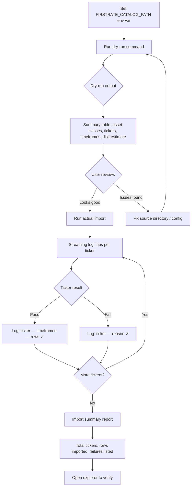
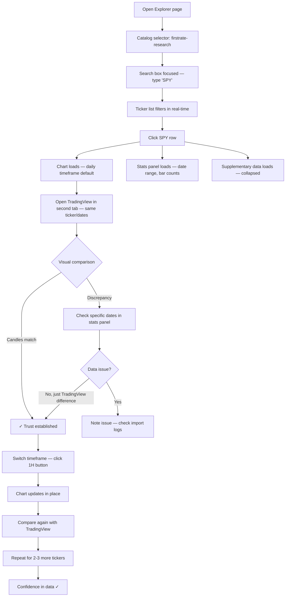
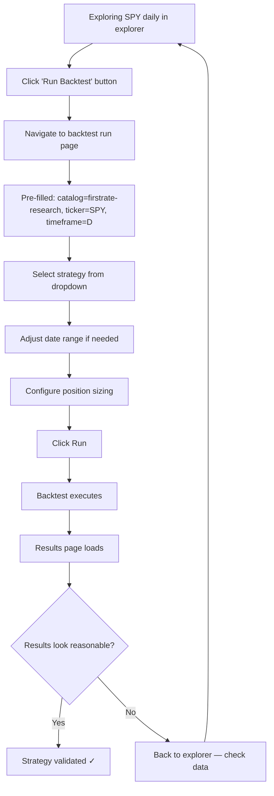
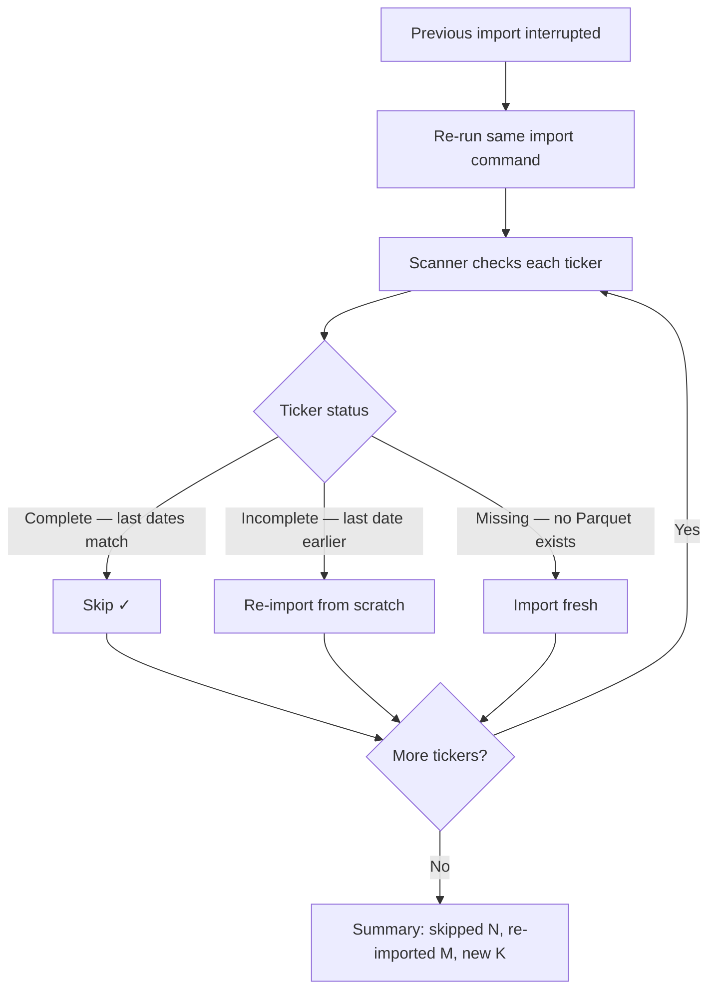

# UX Design Specification Trading-ntrader

**Author:** Allay
**Date:** 2026-04-05

---

<!-- UX design content will be appended sequentially through collaborative workflow steps -->

## Executive Summary

### Project Vision

NTrader's Historical Data Import & Explorer creates a closed research loop for quantitative strategy development: import institutional-grade historical data (FirstRate Data — 20,934 tickers, 7 asset classes, ~387GB), visually explore and verify it, then backtest directly — all without leaving the application. The core UX promise is **data confidence at scale without friction** — eliminating the download-and-wait cycle of broker APIs and removing data quality as a variable in backtest results.

The feature spans two interaction surfaces: a CLI-driven import pipeline for batch data ingestion (dry-run validation, idempotent re-runs, progress reporting) and a web-based data explorer integrated into the existing NTrader UI for interactive browsing, visual verification, and backtest launch.

### Target Users

**Primary user: Allay (sole operator)** — a quantitative developer running backtests on personal infrastructure. Highly technical, comfortable with CLI workflows, familiar with financial data concepts (OHLCV, adjusted prices, timeframes). Uses Chrome/Safari on macOS. Workflow is desktop-based, typically running the web UI alongside TradingView for visual data verification.

**User needs:**
- Quickly answer "what data do I have?" before configuring a backtest
- Visually confirm imported data matches TradingView for trust
- Navigate 20,000+ tickers efficiently by search, filter, and asset class
- Seamlessly transition from exploring data to the existing backtest run page with minimal context-switching
- Understand import status and data quality at a glance

### Key Design Challenges

1. **Scale navigation** — 20,934 tickers across 7 asset classes with 4 timeframes each. A flat paginated list won't scale. The UX needs fast search, asset class filtering, and clear organization to make any ticker findable in seconds
2. **Data confidence workflow** — The explorer's primary purpose is building trust before backtesting. Verification requires comparing OHLC values and chart patterns against TradingView — the UX must make this comparison frictionless (date ranges, statistics, chart rendering at matching timeframes)
3. **Progressive chart loading** — Decades of 1-min data can't load at once. Time-range API slicing with smooth pan/zoom must feel seamless, with clear loading indicators that don't break the visual verification flow
4. **Two-surface coherence** — CLI import and web explorer are separate interfaces but part of one workflow. Import results must surface naturally in the explorer (available tickers, coverage, quality) without requiring manual refresh or mental state-tracking
5. **Integration with existing backtest UI** — NTrader already has a dedicated page for running backtests. The explorer must complement this existing workflow — providing a natural bridge from "exploring data" to "running a backtest" via the existing run page, not duplicating backtest configuration UX

### Design Opportunities

1. **Explorer-to-backtest bridge** — Deep-link from the explorer to the existing backtest run page with pre-filled context (ticker, timeframe, date range). The explorer surfaces what's available; the backtest page handles execution
2. **Data health dashboard** — Surface coverage indicators, gap detection, quality metrics, and import status directly in the ticker list and detail views — making data quality visible at a glance without per-ticker investigation
3. **Existing UI integration** — The web UI already has backtest listing, detail views, and TradingView chart infrastructure. The explorer extends a proven design system rather than introducing new patterns, reducing UX friction for the user

## Core User Experience

### Defining Experience

The core interaction loop is **browse → chart → verify**: find a ticker, load a chart at the desired timeframe, and confirm the data looks correct. This is the most frequent action and must be completely effortless. The target: go from "I want to check SPY daily" to seeing a chart in under 3 seconds total interaction time.

The explorer's primary job is answering two questions: "What data do I have?" and "Can I trust it?" Everything else — backtest launch, supplementary data, statistics — supports these two questions.

### Platform Strategy

- **Desktop web only** — Chrome/Safari on macOS, mouse/keyboard primary
- **No mobile, offline, or touch optimization** — personal tool on personal infrastructure
- **Side-by-side workflow** — the explorer runs alongside TradingView in a second browser tab for visual data verification
- **CLI for import** — batch import operations stay in the terminal; the web UI is for exploration and verification only
- **Existing stack** — FastAPI + Jinja2 + HTMX + Tailwind CSS (dark theme, slate-950), TradingView Lightweight Charts v5.0

### Effortless Interactions

- **Ticker search** — type a few characters, results appear instantly (< 300ms keystroke-responsive filtering across 20,000+ tickers)
- **Timeframe switching** — one click, chart updates in place without full page reload (HTMX partial swap)
- **Data quality scanning** — coverage dates, row counts, and health indicators visible in the ticker list without drilling into each ticker
- **Explorer-to-backtest bridge** — clear path to the existing backtest run page with context carried over (ticker, timeframe, date range as query params)
- **Progressive chart loading** — data loads as you pan/zoom, no manual "load more" actions. Loading states are subtle, never blocking
- **Fresh data on refresh** — explorer reflects newly imported data on page reload without manual cache clearing

### Critical Success Moments

1. **"The data matches"** — Load a ticker in the explorer, open TradingView side-by-side, candles align. Trust in the data established
2. **"I have everything"** — The ticker list shows thousands of tickers with date ranges across asset classes. The scale of what's available is immediately apparent — no more downloading one ticker at a time
3. **"This just works"** — Configure a multi-Stock backtest on the existing run page using FirstRate catalog data, and it completes without error. The closed research loop from import to insight is real

### Experience Principles

1. **Trust through transparency** — Show the data, its quality, and its provenance. Never hide what's available or what might be wrong. Surface coverage gaps, row counts, and date ranges prominently
2. **Speed over features** — A fast, simple explorer that loads charts instantly beats a feature-rich one that's sluggish. Performance IS the UX. Every interaction under 2 seconds
3. **One workflow, two surfaces** — CLI imports, web explores. Both feel like parts of the same tool, not separate products. Import results surface naturally in the explorer
4. **Extend, don't reinvent** — Follow existing NTrader UI patterns (dark theme, NavigationState, HTMX partials, DI chain). The explorer should feel like it was always part of the application

### CLI Import Experience

The CLI import is a utility — reliable and informative, not fancy. Design priorities: data completeness, integrity verification, and clear error reporting.

**Command structure:**
```bash
ntrader import --format firstrate --catalog my-research-data /path/to/csv          # Import all detected asset classes
ntrader import --format firstrate --catalog my-research-data /path/to/csv --asset-class stock  # Import one
ntrader import --format firstrate --catalog my-research-data /path/to/csv --dry-run           # Validate only
```

**Auto-discovery:** Scans source directory, detects asset classes from folder structure, reports findings in a summary table (asset class, ticker count, timeframes, file count, estimated disk usage).

**Progress:** Streaming log lines — one line per ticker with status. Asset class headers separate each batch.

**Error handling:** Keep going on individual ticker failures, report all failures in the final summary. No interactive prompts.

**Integrity focus:**
- Row count verification (source CSV vs output Parquet) on every ticker
- OHLC sanity checks (high >= low, volume >= 0)
- Sample point validation (first/last N rows compared)
- Idempotent re-runs — skips complete tickers, re-imports incomplete ones

**Post-import:** Print summary report and exit.

### Catalog as First-Class Concept

Multiple data catalogs are supported as named, configured data sources. Each catalog has a name, path, and provider format.

**Configuration:** Catalogs are defined in application config (e.g., `firstrate-research`, `ibkr-live`, `kraken-crypto`) with name, path, and format metadata.

**Explorer integration:** A catalog selector in the explorer UI scopes all browsing — ticker list, charts, statistics, and data health — to the selected catalog. Switching catalogs refreshes the view.

**Import integration:** `--catalog <name>` on the import command targets an existing catalog or creates a new one.

**Backtest integration:** The existing backtest run page needs catalog awareness — which catalog to pull data from. The explorer-to-backtest bridge carries catalog context alongside ticker, timeframe, and date range.

## Desired Emotional Response

### Primary Emotional Goals

**Confidence** is the core emotional target. "I trust this data. I trust these results. I can act on this." The entire feature exists to eliminate doubt — doubt about data quality, doubt about coverage, doubt about whether backtest inputs are correct. This is a power-user research tool; the emotional register is confidence and control, not consumer delight.

### Emotional Journey Mapping

| Stage | Feeling | What drives it |
|---|---|---|
| First import (CLI) | **Reassurance** — "it's handling this correctly" | Streaming progress, integrity checks reported inline, clear summary |
| Explorer first load | **Capability** — "I have all of this" | Seeing thousands of tickers with date ranges, the scale of the dataset |
| Chart verification | **Trust** — "this matches, the data is clean" | Charts align with TradingView, statistics look right |
| Exploring tickers | **Flow** — "this is fast and responsive" | Sub-second search, instant timeframe switches, smooth chart panning |
| Error/failure | **Calm clarity** — "I know what went wrong and what to do" | Clear error messages, failure reasons in summary, no data corruption |
| Launching backtest | **Momentum** — "I'm already set up, just go" | Context carries from explorer to backtest page, no re-entering data |
| Returning to explorer | **Familiarity** — "I know exactly where everything is" | Consistent patterns, same UI as rest of NTrader |

### Emotions to Avoid

- **Doubt** — "Is this data actually correct?" (defeated by verification UX)
- **Tedium** — "I have to click through each ticker one by one" (defeated by search/filter/batch views)
- **Anxiety** — "Did the import corrupt something?" (defeated by integrity checks and idempotent re-runs)
- **Disorientation** — "Where am I? How do I get back?" (defeated by consistent navigation patterns)

### Design Implications

- **Confidence** → Show verification data prominently (row counts, date ranges, OHLC stats). Never hide data quality
- **Flow** → Every interaction under 2 seconds. No full page reloads for common actions. HTMX partial swaps
- **Calm clarity on errors** → Errors are informative, not alarming. "3 tickers failed (see details)" not "IMPORT FAILED"
- **Capability** → The ticker list itself communicates scale. Numbers, coverage bars, asset class counts visible at a glance

### Emotional Design Principles

1. **Data speaks first** — Surface numbers, dates, and quality indicators before asking the user to take action. Confidence comes from seeing the evidence
2. **Errors are information, not alarms** — Failures are expected at scale (20,000+ tickers). Report them calmly with context and next steps
3. **Speed builds trust** — A responsive UI feels reliable. Sluggishness creates subconscious doubt about the tool's competence
4. **Consistency reduces cognitive load** — Every new page that looks and behaves like existing NTrader pages is one less thing to learn

## UX Pattern Analysis & Inspiration

### Inspiring Products Analysis

**TradingView** — The benchmark for financial charting UX. Key strengths: instant ticker search with autocomplete and asset class badges, one-click timeframe switching via toolbar buttons, smooth chart pan/zoom with progressive data loading that's invisible to the user. The chart is the hero — everything else (tools, indicators, settings) stays out of the way until needed. The symbol search modal is the fastest path to any instrument.

**Grafana** — Data exploration across multiple sources. Key strengths: data source selector that scopes all panels/queries, time-range picker that persists across navigation, dashboard-level context that doesn't reset when drilling into details. The "explore" mode lets you query raw data without building a dashboard first — similar to our explorer's "just look at the data" use case.

**Bloomberg Terminal / Koyfin** — Dense financial data display. Key strengths: information-dense layouts that remain scannable through strong visual hierarchy (numbers, labels, color-coding for up/down/neutral). Koyfin specifically shows how to make large ticker tables readable with inline sparklines, coverage indicators, and sortable columns — without feeling cluttered.

**GitHub Code Search / Sourcegraph** — Searching at scale. Key strengths: keystroke-responsive search across millions of items, faceted filtering (language, repo, path), results that show enough context to decide without clicking through. The search-first UX pattern — type to find, then drill in — is the right model for 20,000+ tickers.

### Transferable UX Patterns

**Navigation Patterns:**
- **Search-first navigation** (TradingView, GitHub) — The primary entry point is a search box, not a hierarchical menu. Type a ticker, get instant filtered results. Pagination is a fallback, not the primary discovery mechanism
- **Persistent context selector** (Grafana) — The catalog selector at the top of the explorer scopes everything below it. Switching catalog refreshes the view but preserves the interaction pattern. Similar to Grafana's data source dropdown
- **Toolbar timeframe buttons** (TradingView) — Timeframe switching via a row of buttons (1m, 5m, 1H, D) rather than a dropdown. One click, no menu navigation. The active timeframe is visually highlighted

**Interaction Patterns:**
- **Progressive chart loading** (TradingView) — Data loads as you pan/zoom. No loading spinners in the chart area — new candles appear seamlessly. The chart never shows empty space where data should be
- **Inline data density** (Koyfin, Bloomberg) — Ticker list rows show key metadata inline (date range, row count, asset class badge) without requiring drill-in. Reduces clicks-to-insight
- **Faceted filtering** (GitHub) — Asset class as a filter facet alongside search. Visual pills or sidebar toggles, not a separate page. Filter state reflected in the URL for bookmarkability

**Visual Patterns:**
- **Chart as hero** (TradingView) — When viewing a ticker, the chart dominates the viewport. Statistics and metadata are secondary panels, not competing for attention
- **Dark theme data visualization** (TradingView, Grafana) — Green/red for price direction on a dark background. Already the NTrader pattern — extend it consistently to the explorer
- **Scale indicators** (Koyfin) — Small visual cues that communicate data coverage at a glance: date range bars, coverage percentage, asset class color-coding in the ticker list

### Anti-Patterns to Avoid

- **Full-page reloads for filter changes** — Kills the exploratory flow. Every filter, sort, and search must update in-place via HTMX partials
- **Chart loading spinners that block interaction** — TradingView never shows a spinner over the chart. Data appears progressively. A blocking spinner breaks the verification workflow
- **Nested navigation to reach data** — "Select catalog → Select asset class → Select ticker → Select timeframe" as sequential pages. Too many clicks. Flatten the hierarchy: catalog selector + search + timeframe buttons on one page
- **Hiding metadata behind hover/click** — Date ranges, row counts, and quality indicators should be visible in the ticker list, not behind tooltips or detail modals. The user needs to scan, not investigate

### Design Inspiration Strategy

**Adopt directly:**
- TradingView's search-first ticker navigation and toolbar timeframe buttons
- Grafana's persistent data source selector pattern for catalog switching
- Koyfin's inline data density in ticker list rows

**Adapt for our context:**
- TradingView's progressive chart loading — adapt for server-side Parquet slicing via FastAPI rather than their binary tile CDN approach
- GitHub's faceted filtering — simplified to asset class filter + text search (we don't need the full facet complexity)

**Avoid:**
- Bloomberg's information overload — we have fewer data dimensions; don't add visual noise to fill space
- Grafana's query builder complexity — our explorer is browse-and-view, not query-and-build
- Multi-step wizards or sequential page flows — keep everything on one explorer page with in-place updates

## Design System Foundation

### Design System Choice

**Extend the existing NTrader design system.** No new CSS frameworks, component libraries, or build system changes. The explorer is built with the same stack and patterns as the rest of the application.

**Existing stack:**
- Tailwind CSS — dark theme (slate-950 background), utility-first styling
- HTMX — partial page updates, fragment swaps, URL-preserved state
- Jinja2 — template inheritance (`base.html` → page → fragment), macros for reusable components
- TradingView Lightweight Charts v5.0 — financial charting (CDN-loaded)
- Existing components: navigation bar, breadcrumbs, metrics panels, trade tables, sort header macros, filter state preservation

### Rationale for Selection

- **Consistency** — The explorer must feel like part of NTrader, not a bolted-on feature. Same theme, same interaction patterns, same template structure
- **Zero overhead** — No new dependencies, no new build steps, no learning curve. Solo developer, established patterns
- **Proven patterns** — NavigationState, FilterState, HTMX fragment swaps, DI chain are all battle-tested in the existing backtest UI
- **Performance** — Tailwind CSS purges unused styles, HTMX avoids full page reloads, TradingView charts handle 60fps natively

### Implementation Approach

New explorer pages follow the existing template hierarchy:
- `base.html` provides the shell (nav, HTMX, chart libraries, Tailwind)
- Explorer page templates extend `base.html` with ``
- Fragment templates for HTMX partial updates (ticker list, chart area, statistics panel)
- New routes in `src/api/ui/` following the existing DI chain pattern

### New Components Required

The explorer introduces these new UI components, all built with Tailwind CSS and Jinja2:

1. **Search input with instant filtering** — Text input with `hx-trigger="keyup changed delay:300ms"` for keystroke-responsive ticker search. Not present in current UI
2. **Catalog selector dropdown** — Persistent dropdown at top of explorer, scoping all content to the selected catalog. Modeled after Grafana's data source selector
3. **Ticker list with inline metadata** — Denser than the current backtest list: asset class badge, date range, row count, timeframe availability indicators per row
4. **Timeframe button toolbar** — Horizontal button group (1m, 5m, 1H, D) for one-click timeframe switching. Active state visually highlighted. Modeled after TradingView
5. **Data statistics panel** — Ticker-level metadata display: date range, row counts per timeframe, min/max prices, data quality indicators
6. **Asset class filter pills** — Horizontal pill buttons for filtering the ticker list by asset class. Multiple selection supported. Filter state preserved in URL query params

## Defining Experience

### Core Interaction

**"Search a ticker, see the chart, trust the data."** This is the defining loop. Everything else — backtest launch, supplementary data, statistics — is in service of making this feel instant and trustworthy. The explorer is TradingView's search-and-chart flow plus a data catalog's "what do I have?" transparency.

### User Mental Model

The mental model is already established: type a symbol, see a chart. No new interaction pattern to learn. Users approach this the same way they approach TradingView. What's different is what surrounds the chart: data quality indicators, coverage metadata, and the bridge to backtesting.

**What this replaces:**
- Checking if data exists by looking at the file system or running CLI queries
- Manually loading a CSV or configuring a backtest just to see if the data looks right
- Opening TradingView separately to spot-check prices
- Hoping the data is correct without verification tools

### Success Criteria

- Ticker found and chart rendered in under 3 seconds from first keystroke
- Chart visually matches TradingView for the same ticker/period on side-by-side comparison
- Data quality metadata (date range, row counts, coverage) visible without any extra clicks
- Transition from explorer to backtest run page carries full context (catalog, ticker, timeframe, date range)
- Returning to the explorer after running a backtest feels like coming back to a workspace, not starting over

### Pattern Analysis

Entirely **established patterns** — search box, chart view, filter pills, toolbar buttons. No novel UX required. The innovation is in the **combination**: a financial chart explorer that also shows catalog-level data quality metadata. TradingView doesn't show "you have 5,523 daily bars." Bloomberg doesn't let you one-click into a backtest. The unique value is the integration, not any single interaction.

### Experience Mechanics

**1. Initiation — Landing on the explorer page:**
- Catalog selector shows the active catalog (e.g., "firstrate-research")
- Search box is focused and ready for input — it's the hero element
- Asset class filter pills below (All, Stock, ETF, Futures, FX, Crypto, Index, Delisted) with counts. Pills with zero count are hidden when no search filter is active, and render as "Class 0" when a search filter narrows the result to zero (Phase 1: only "All" and "Stock" render by default)
- Paginated ticker list showing all tickers in the selected catalog with inline metadata

**2. Interaction — Finding and viewing a ticker:**
- Type "SPY" → ticker list filters in real-time (< 300ms) via HTMX partial swap
- Click a ticker row → chart area loads with daily timeframe as default
- Timeframe toolbar (1m, 5m, 1H, D) appears above the chart — click to switch, chart swaps in place
- Statistics panel shows alongside: date range, row counts per timeframe, min/max prices
- Pan/zoom the chart — progressive loading fetches more data seamlessly

**3. Feedback — Knowing the data is good:**
- Chart renders with familiar TradingView candlesticks — visual pattern recognition kicks in immediately
- Date range displayed prominently: "2003-01-02 to 2024-12-31"
- Row count per timeframe: "Daily: 5,523 bars | 1H: 44,184 bars | 1m: 2,651,040 bars"
- No red flags = confidence. If issues exist, they're surfaced as inline warnings, not hidden

**4. Completion — Moving to action:**
- "Run Backtest" link pre-fills the existing backtest run page with ticker, catalog, timeframe, and date range
- Or: continue exploring — search another ticker, switch asset class filter, change catalog
- No explicit "done" state — the explorer is a workspace you leave when ready

## Visual Design Foundation

### Color System

**Inherit the existing NTrader dark theme.** No new color definitions needed — the explorer uses the same Tailwind palette as the rest of the application.

- **Background:** `slate-950` (page), `slate-900` (cards/panels), `slate-800` (hover states, borders)
- **Text:** `slate-100` (primary), `slate-400` (secondary/muted), `white` (emphasis)
- **Accent:** Existing `CHART_COLORS` from `charts-core.js` — green for positive/up, red for negative/down
- **Interactive:** `blue-500` for links and active states (consistent with existing UI)
- **Status:** `green-500` (success/complete), `yellow-500` (warning), `red-500` (error/failure)
- **Asset class badges:** Distinct muted colors per asset class for visual scanning in the ticker list — Stock = blue (Phase 1 primary), ETF = slate, Futures = amber, FX = emerald, Crypto = purple, Index = cyan, Delisted = gray

### Typography System

**Inherit existing Tailwind defaults.** No custom fonts.

- **Headings:** Tailwind default sans-serif, `font-semibold`, standard size scale (`text-2xl` for page title, `text-lg` for section headers)
- **Body text:** Tailwind default, `text-sm` for most UI elements (labels, descriptions)
- **Data values:** `font-mono` for all numeric data (prices, row counts, dates) — ensures column alignment and communicates "this is data, not prose"
- **Ticker symbols:** `font-mono font-bold` — visually distinct, scannable in the list

### Spacing & Layout Foundation

**Layout: Stacked (Full-Width Sections)** — Full-width sections stacked vertically. Simpler to implement with HTMX partial swaps, consistent with existing NTrader page patterns.

```
┌──────────────────────────────────────────┐
│ Nav bar                                  │
├──────────────────────────────────────────┤
│ Catalog selector | Search | Asset pills  │
├──────────────────────────────────────────┤
│ Ticker list (paginated, full width)      │
├──────────────────────────────────────────┤
│ Timeframe toolbar                        │
│ Chart (full width)                       │
│ Statistics panel                         │
└──────────────────────────────────────────┘
```

**Rationale:**
- Consistent with existing NTrader page structure (full-width content, no sidebars)
- Each section is an independent HTMX swap target — simpler partial updates
- Full-width chart maximizes the viewport for visual verification (the primary task)
- Full-width ticker list shows more columns of inline metadata per row
- Responsive by default — stacked layout works at any viewport width without breakpoint logic

**Spacing:**
- Tailwind utility spacing: `gap-4` between major sections, `p-4` for panel padding
- Consistent with existing page spacing in backtest list/detail views
- Compact ticker list rows (`py-2`) for data density — more tickers visible without scrolling

### Accessibility Considerations

- **Contrast:** Tailwind dark theme defaults meet WCAG AA for text on dark backgrounds. `slate-100` on `slate-950` exceeds 4.5:1 contrast ratio
- **Keyboard navigation:** Search box focused on page load; ticker list rows focusable via tab; timeframe buttons in a keyboard-navigable group
- **No reliance on color alone:** Asset class badges include text labels, not just color. Chart direction communicated by candle shape in addition to green/red
- **Font sizing:** `text-sm` (14px) minimum for all readable content — no smaller text in the UI

## Design Direction Decision

### Design Directions Explored

Six visual directions were generated and evaluated via interactive HTML mockups (`ux-design-directions.html`):

1. **Clean Minimal** — Maximum clarity, progressive disclosure. Chart appears only on ticker selection
2. **Data Dense** — Koyfin/Bloomberg-inspired compact rows with sparklines, coverage bars, per-timeframe counts
3. **Search Hero** — Large centered search, page fills progressively. Catalog stats on landing
4. **Card Layout** — Grid of ticker cards instead of table rows. More visual, fewer items per viewport
5. **Dashboard Overview** — Catalog-level health and asset class breakdown as landing page
6. **Minimal + Inline Stats** — Hybrid of 1 and 2 with collapsible supplementary data

### Chosen Direction

**Direction 6: Minimal + Inline Stats** — a balanced hybrid that combines a clean table layout with strategic data density and collapsible supplementary data sections.

**Key elements:**
- Clean table with coverage bars and combined bar counts (D / 1H / 1m) inline per row
- Asset class badges, date ranges, and coverage visible without drill-in
- Full-width chart with timeframe toolbar and "Run Backtest" action button
- Statistics panel below chart (date range, bar counts per timeframe, price range, Nautilus ID)
- Collapsible supplementary data sections (company profile, dividends, splits) via `<details>` elements
- Breadcrumb navigation showing catalog > ticker context
- Pagination info showing result count for current search/filter

### Design Rationale

- **Balances density with clarity** — Enough inline metadata to scan 20,000+ tickers without opening each one, but not so dense that it feels like a terminal
- **Progressive detail** — Supplementary data (company profile, dividends) is available but collapsed by default. Users who need it expand it; users who don't aren't distracted
- **Full-width chart** — Maximizes viewport for the primary task (visual verification against TradingView). No competing sidebar
- **Consistent with NTrader** — Stacked layout, table-based lists, card-style stats — all patterns already used in backtest list/detail pages
- **HTMX-friendly** — Each section (ticker list, chart area, stats panel, supplementary data) is an independent swap target for partial updates

### Implementation Approach

**Page structure (single explorer page with HTMX regions):**
```
templates/explorer/
├── explorer.html           # Full page extending base.html
├── ticker_list.html        # HTMX fragment: filtered/paginated ticker table
├── chart_panel.html        # HTMX fragment: chart + timeframe toolbar
├── stats_panel.html        # HTMX fragment: ticker statistics
└── supplementary.html      # HTMX fragment: collapsible company/dividend/split data
```

**Interaction flow:**
1. Page loads with catalog selector, search box (focused), asset class pills, and full ticker list
2. Typing in search → `hx-get` with 300ms debounce swaps `ticker_list.html` fragment
3. Clicking a ticker row → `hx-get` swaps chart, stats, and supplementary fragments simultaneously
4. Clicking timeframe button → `hx-get` swaps chart fragment only (stats may also update)
5. "Run Backtest" link navigates to existing backtest run page with query params: `?catalog=...&ticker=...&timeframe=...&start=...&end=...`

**New API endpoints needed:**
- `GET /api/explorer/tickers?catalog=...&search=...&asset_class=...&page=...` — paginated ticker list with metadata
- `GET /api/chart/{ticker}?catalog=...&tf=...&start=...&end=...` — windowed OHLCV data for chart rendering
- `GET /api/explorer/ticker/{ticker}/stats?catalog=...` — ticker statistics and supplementary data

## User Journey Flows

### Journey 1: First-Time Data Import

**Goal:** Get FirstRate Data CSV files into the NTrader Parquet catalog for backtesting.
**Surface:** CLI only.



**Key UX moments:**
- Dry-run builds confidence before committing disk space
- Streaming log lines provide reassurance during long imports
- Failures don't block progress — reported calmly in summary
- Summary report is the "done" signal — clear, scannable, actionable if failures occurred

### Journey 2: Data Verification Against TradingView

**Goal:** Confirm imported data is accurate by visual comparison with TradingView.
**Surface:** Web explorer (primary) + TradingView in second tab.



**Key UX moments:**
- Search box auto-focused — zero clicks to start searching
- Chart + stats load simultaneously on ticker selection — no sequential loading
- Timeframe switching is one click, no page reload
- Stats panel shows exact date range and bar counts for comparison reference
- The workflow is: search → click → compare → next ticker. Repeat until confident

### Journey 3: Explorer to Backtest

**Goal:** Go from browsing data in the explorer to running a backtest on the existing run page.
**Surface:** Web explorer → existing backtest run page.



**Key UX moments:**
- "Run Backtest" button carries context via query params — no re-entering ticker/timeframe/catalog
- The backtest run page is the existing page, not a new one — familiar UI
- Round-trip: explorer → backtest → results → explorer is seamless navigation
- Breadcrumbs and navigation maintain context throughout

### Journey 4: Failed Import Recovery

**Goal:** Resume an interrupted import without re-processing completed tickers.
**Surface:** CLI only.



**Key UX moments:**
- Exact same command — no special "resume" flag needed
- Skipped tickers logged but not noisy — just a count in the summary
- Re-imported tickers get full streaming log treatment
- Summary distinguishes skipped vs re-imported vs new for clarity

### Journey Patterns

**Common patterns across all journeys:**

**Navigation pattern — Context preservation:**
Every transition between pages carries relevant context (catalog, ticker, timeframe, date range) via URL query params. The user never re-enters information they've already selected.

**Feedback pattern — Progressive confidence:**
Each journey builds confidence incrementally: dry-run before import, chart comparison before backtest, stats panel alongside chart. No "trust me" moments — data is always visible.

**Error pattern — Calm reporting:**
Errors are logged inline and summarized at the end. Individual failures don't block the workflow. The summary distinguishes severity (data issue vs skip vs success).

**Entry pattern — Minimal friction:**
Every journey starts with the fewest possible inputs. Import: just a path and optional flags. Explorer: search box auto-focused. Backtest: pre-filled from explorer context.

### Flow Optimization Principles

1. **Minimize clicks to chart** — From explorer landing to viewing a chart should be: type ticker (1 action) → click row (1 action) = 2 interactions
2. **No dead ends** — Every page has a clear next action. Explorer: "Run Backtest." Import summary: "Open Explorer." Backtest results: back to explorer or re-run
3. **Batch over sequential** — Import processes all tickers without pausing. Explorer loads chart + stats + supplementary in parallel, not sequentially
4. **State in the URL** — Search text, asset class filter, selected catalog, current page — all in query params. Refreshing the page preserves state. Shareable URLs
5. **Errors don't compound** — A failed ticker import doesn't affect other tickers. A chart load failure shows an error message in the chart area without breaking the rest of the page

## Component Strategy

### Existing Design System Components (Reused As-Is)

These existing NTrader components are used directly in the explorer without modification:

| Component | Source | Usage in Explorer |
|---|---|---|
| Navigation bar | `partials/nav.html` | Top nav with "Explorer" link added |
| Breadcrumbs | `partials/breadcrumbs.html` | Explorer > catalog > ticker context |
| Base page layout | `base.html` | Block structure, HTMX/TradingView JS loading |
| Pagination | Existing backtest list pattern | Ticker list pagination |
| Sort headers | Jinja2 macro | Ticker list column sorting |

### Custom Components

#### 1. Catalog Selector

**Purpose:** Scope all explorer content to a specific data catalog.
**Anatomy:** Dropdown select element with catalog name and ticker count.
**States:**
- Default: shows active catalog name + ticker count
- Open: dropdown list of all configured catalogs
- Loading: brief indicator while catalog metadata loads after switch

**Behavior:**
- Persists selection in URL query param (`?catalog=firstrate-research`)
- Switching catalog triggers full content refresh (ticker list, stats reset, chart cleared)
- Catalog list sourced from application config at page load

**Implementation:** `<select>` with `hx-get` on change, targeting the full content area. Tailwind: `bg-slate-800 border-slate-700 text-slate-100`.

#### 2. Ticker Search Input

**Purpose:** Keystroke-responsive filtering of the ticker list across 20,000+ tickers.
**Anatomy:** Text input with search icon, inside the filter bar.
**States:**
- Empty/placeholder: "Search tickers..."
- Active: user typing, debounced request in flight
- Results: ticker list updates with match count shown in pagination info
- No results: ticker list shows "No tickers found for '{query}'"

**Behavior:**
- `hx-trigger="keyup changed delay:300ms"` on the input
- `hx-get` targets the ticker list fragment
- Sends search text + current asset class filter + catalog as params
- Auto-focused on page load via `autofocus` attribute
- Clears on Escape key

**Implementation:** `<input type="text">` with HTMX attributes. Tailwind: `bg-slate-800 border-slate-700 text-slate-100 placeholder-slate-500`.

#### 3. Asset Class Filter Pills

**Purpose:** Filter ticker list by asset class. Visual indication of available categories and counts.
**Anatomy:** Horizontal row of pill buttons, each showing asset class name and ticker count.
**States:**
- Default (inactive): `border-slate-700 text-slate-400`
- Active (selected): `bg-blue-500 border-blue-500 text-white`
- Hover: `border-slate-500 text-slate-100`

**Behavior:**
- "All" pill is default active state
- Clicking a pill filters the ticker list via `hx-get`
- Multiple selection NOT supported (one active at a time, or "All")
- Counts update based on current catalog
- Filter state preserved in URL param (e.g. `?asset_class=stock`)

**Implementation:** `<button>` elements with `hx-get` targeting ticker list fragment. Active state toggled via server-rendered class.

#### 4. Ticker List Table

**Purpose:** Paginated, sortable display of all tickers with inline metadata.
**Anatomy per row:** Symbol (mono bold) | Name | Asset class badge | Date range (mono) | Coverage bar | Bar counts "D / 1H / 1m" (mono)
**States:**
- Default row: `border-b border-slate-800`
- Hover: `bg-slate-800`
- Selected (active ticker): `bg-slate-800/blue-900` highlight
- Loading: subtle loading bar at top of table during filter/search updates

**Behavior:**
- Clicking a row selects the ticker and loads chart + stats + supplementary panels
- Row click uses `hx-get` with multiple `hx-target` attributes (or a single request returning out-of-band swaps via `hx-swap-oob`)
- Sortable by symbol, date range, bar count via header clicks
- Pagination: 25 rows per page, page state in URL

**Sub-components:**
- **Asset class badge:** Colored pill per asset type (Stock=blue — Phase 1 primary, ETF=slate, Futures=amber, FX=emerald, Crypto=purple, Index=cyan, Delisted=gray)
- **Coverage bar:** 4px tall, green fill proportional to date range vs catalog maximum. `bg-slate-800` track, `bg-green-500` fill
- **Bar counts:** Compact format "8K / 51K / 3.1M" for daily / hourly / minute

#### 5. Timeframe Toolbar

**Purpose:** One-click timeframe switching for the chart view.
**Anatomy:** Horizontal button group: 1m | 5m | 1H | D
**States:**
- Default button: `border-slate-700 text-slate-400 bg-transparent`
- Active (selected timeframe): `bg-blue-500 border-blue-500 text-white`
- Hover: `border-slate-500 text-slate-100`
- Disabled (timeframe not available for ticker): `opacity-50 cursor-not-allowed`

**Behavior:**
- Clicking a button swaps the chart fragment via `hx-get`
- Active state rendered server-side based on current timeframe param
- Disabled state for timeframes not available in the current ticker's catalog data
- Timeframe preserved in URL param (`?tf=D`)

**Implementation:** `<button>` group with `hx-get` targeting chart panel fragment. Mono font for button labels.

#### 6. Data Statistics Panel

**Purpose:** Display ticker-level metadata and data quality indicators.
**Anatomy:** Grid of stat cards (responsive, auto-fit columns).
**Cards:** Date Range | Daily Bars | 1-Hour Bars | 5-Min Bars | 1-Min Bars | Price Range | Nautilus ID
**States:**
- Loaded: stat values displayed
- Empty (no ticker selected): panel hidden or shows "Select a ticker to view statistics"

**Behavior:**
- Loads simultaneously with chart on ticker selection
- Updates when timeframe changes (price range may differ per timeframe)
- Stat values use `font-mono` for numeric data

**Implementation:** `<div>` grid with stat cards. Each card: label (`text-xs text-slate-500 uppercase`), value (`font-mono text-lg font-semibold`), optional subtitle (`text-xs text-slate-500`).

### Component Implementation Strategy

**All components are server-rendered Jinja2 templates + Tailwind CSS + HTMX attributes.** No client-side JavaScript framework. No custom CSS beyond Tailwind utilities. The only JavaScript is TradingView Lightweight Charts for chart rendering (already in the codebase).

**HTMX swap strategy:**
- Ticker search and filter: swap `#ticker-list` container
- Ticker selection: swap `#chart-panel`, `#stats-panel`, `#supplementary-panel` (using `hx-swap-oob` for multiple targets from one request)
- Timeframe change: swap `#chart-panel` only
- Catalog change: swap entire `#explorer-content` container

### Implementation Roadmap

**Phase 1 — MVP (Stocks import + explorer):**
All 6 components are needed for Phase 1. Build order by dependency:

1. **Catalog Selector** + **Ticker Search** + **Asset Class Pills** — the filter bar. Needed before the ticker list makes sense
2. **Ticker List Table** — the core browsing component. Depends on filter bar for search/filter inputs
3. **Timeframe Toolbar** + **Chart Panel** — the verification experience. Depends on ticker selection
4. **Data Statistics Panel** — supporting detail. Loads alongside chart

**No phased rollout within the explorer** — all components ship together as a single feature. The explorer is not useful without search + list + chart working together.

## UX Consistency Patterns

### Loading States

**Chart loading (progressive):**
- Chart area shows existing data while new data loads at the edges during pan/zoom
- No spinner overlay on the chart — data appears progressively
- Thin 2px animated loading bar at the top of the chart panel during initial load

**Ticker list loading (search/filter):**
- Subtle loading bar at top of the ticker table during HTMX swap
- Previous results stay visible until new results arrive (no flash of empty content)
- HTMX `hx-indicator` pattern with a thin progress bar

**Fragment loading (stats, supplementary):**
- Skeleton-style placeholder (subtle `animate-pulse` on `bg-slate-800` rectangles) while content loads
- Replaced atomically when server response arrives

### Empty States

**No ticker selected:**
- Chart area, stats panel, and supplementary section are hidden (not shown with placeholder text)
- The page is just: filter bar + ticker list. Clean and focused

**No search results:**
- Ticker list shows: "No tickers found for '{query}'" centered in the table body
- Asset class pill counts update to reflect filtered state (e.g., "Stock 0" if no Stocks match)

**Empty catalog:**
- Full page message: "No data in catalog '{name}'. Run an import to get started."
- Shows the import command example: `ntrader import --format firstrate --catalog {name} /path/to/data`

**Chart data unavailable for timeframe:**
- Chart area shows: "No {timeframe} data available for {ticker}"
- Timeframe button shown as disabled (grayed out) before clicking

### Feedback Patterns

**Success feedback:**
- No explicit success toasts or banners in the explorer — successful actions are self-evident (chart loads, list updates, stats appear)
- CLI import: green checkmark per ticker in streaming log, green summary line at end

**Error feedback (explorer):**
- Chart load failure: error message displayed in the chart area itself (not a toast), with slate-800 background. "Failed to load chart data for {ticker}. {reason}"
- API failure: HTMX error swap shows inline error message in the affected fragment, not a full-page error
- Network failure: HTMX retries once, then shows "Connection error. Refresh to retry."

**Error feedback (CLI import):**
- Per-ticker failure: red ✗ in streaming log with one-line reason
- Summary: "N tickers failed" with reasons listed in a table at the end
- No scary error formatting — just clear, factual reporting

**Warning feedback:**
- Data quality warnings (e.g., gaps detected, unusual price spikes) shown as yellow inline banners below the stats panel: "Warning: 3 trading day gaps detected in daily data"
- Non-blocking — the chart and stats still display normally

### Navigation Patterns

**Primary navigation:**
- Top nav bar with: Dashboard | Explorer | Backtests | Run Backtest
- Active page highlighted (consistent with existing NTrader pattern)
- Explorer added as a new nav item

**Breadcrumbs:**
- Explorer > {catalog name} > {ticker symbol} (when a ticker is selected)
- Each segment is a link: clicking catalog returns to the unfiltered ticker list, clicking Explorer returns to default catalog view
- Uses existing `breadcrumbs.html` partial with `NavigationState`

**Context preservation across pages:**
- Explorer → Run Backtest: query params carry catalog, ticker, timeframe, date range
- Backtest results → Explorer: "Back to Explorer" link preserves the last explorer state (catalog, search, filter) via URL params
- Browser back button works naturally — all state is in the URL

**Deep linking:**
- Every explorer state is a bookmarkable URL: `/explorer?catalog=firstrate-research&search=AAPL&asset_class=stock&ticker=AAPL&tf=D`
- Sharing a URL reproduces the exact view (selected catalog, search query, active filters, selected ticker, timeframe)

### Search and Filtering Patterns

**Search behavior:**
- Prefix matching: typing "SP" matches SPY, SPYG, SPYV, SPX (not substring matching — avoids noise)
- Case insensitive
- Debounced at 300ms — no request fires until the user pauses typing
- Search text preserved in URL param for bookmarkability
- Empty search box = show all tickers (unfiltered, paginated)

**Filter behavior:**
- Asset class pills are exclusive (one active at a time, or "All")
- Filters combine with search: selecting "Stock" + typing "SP" = Stocks matching "SP"
- Filter changes reset pagination to page 1
- Filter state preserved in URL params

**Sort behavior:**
- Ticker list sortable by: Symbol (A-Z), Date Range (newest/oldest first), Daily Bar Count (high/low)
- Default sort: Symbol A-Z
- Sort state preserved in URL params
- Uses existing sort header macro pattern from backtest list

### Button Hierarchy

**Primary action:** `bg-blue-500 text-white` — one per context maximum. In the explorer: "Run Backtest" button in the chart header
**Secondary actions:** `border-slate-700 text-slate-400` outline style — timeframe buttons, filter pills, pagination buttons
**No destructive actions in the explorer** — nothing to delete, no confirmation modals needed

## Responsive Design & Accessibility

### Responsive Strategy

**Desktop-only.** No responsive breakpoints, no mobile layout, no touch optimization. This is a personal tool running on macOS with Chrome/Safari on a desktop or laptop display.

**Minimum supported viewport:** 1280px wide (standard laptop). The stacked layout works naturally at any width above this — Tailwind's utility grid (`grid-template-columns: repeat(auto-fit, minmax(200px, 1fr))`) handles stat card reflow automatically.

**No breakpoint system needed.** The layout is:
- Full-width filter bar (flex-wrap handles narrow viewports naturally)
- Full-width ticker table (horizontal scroll if columns exceed viewport — unlikely at 1280px+)
- Full-width chart (fills available width — TradingView Lightweight Charts handles resize)
- Auto-fit stat card grid (reflows based on available width)

### Accessibility Strategy

**Target: WCAG AA baseline.** Not for compliance reasons (personal tool), but because accessible patterns produce better UX for everyone — keyboard navigation, clear focus states, and sufficient contrast benefit the primary user too.

**What we implement:**
- **Color contrast:** Already met — `slate-100` on `slate-950` exceeds WCAG AA 4.5:1 ratio
- **Keyboard navigation:** Tab through search box → filter pills → ticker list rows → timeframe buttons → Run Backtest button. Arrow keys within button groups (pills, timeframe toolbar)
- **Focus indicators:** Visible focus ring on all interactive elements (`focus:ring-2 focus:ring-blue-500`)
- **Semantic HTML:** `<table>` for ticker list (not div-based grid), `<button>` for interactive controls, `<nav>` for navigation, `<details>` for collapsible sections
- **ARIA labels:** Search input (`aria-label="Search tickers"`), filter pills (`aria-pressed` state), selected ticker row (`aria-selected`), chart region (`aria-label="Price chart for {ticker}"`)
- **No color-only information:** Asset class badges include text labels. Chart candle direction communicated by shape. Coverage bars have text fallback in bar counts column

**What we skip (out of scope for personal tool):**
- Screen reader optimization beyond semantic HTML + ARIA labels
- High contrast mode
- Reduced motion preferences
- Touch target sizing (no touch devices)
- Right-to-left language support

### Testing Strategy

**Responsive testing:** Not needed — single platform (desktop macOS).

**Accessibility testing:**
- Keyboard-only navigation test: complete the full explorer journey (search → select → chart → timeframe → Run Backtest) without using the mouse
- Tab order verification: ensure logical flow through the page
- Contrast check: automated via browser dev tools (already confirmed for Tailwind dark theme)

**Functional testing:**
- Use the existing `agent-browser` skill for UI testing (Playwright-based)
- Test the HTMX partial swap behavior: search filtering, ticker selection, timeframe switching
- Verify URL state preservation: bookmark a URL, open it, confirm the view matches

### Implementation Guidelines

- Use semantic HTML elements (`<table>`, `<button>`, `<nav>`, `<details>`) — not `<div>` with click handlers
- Add `autofocus` to the search input
- Use Tailwind's `focus:` variants for visible focus indicators on all interactive elements
- Use `aria-pressed="true/false"` on filter pills to communicate toggle state
- Use `aria-selected="true"` on the active ticker row
- TradingView chart is a `<canvas>` element — wrap it in a `<div role="img" aria-label="...">` for accessibility context
- Ensure all `hx-get` targets have `aria-live="polite"` so screen readers announce content updates
