# Milestone 3: Integration-First Execution Plan

**Generated**: 2025-09-18
**Philosophy**: Continuous Integration - Each task produces a working, testable system

## Integration Strategy Overview

```
PRINCIPLE: Never build in isolation. Every component integrates immediately.
APPROACH: Extend the working Milestone 2 system incrementally.
VALIDATION: After each task, the system must still run end-to-end.
```

## Current Working System (Baseline)

```bash
# What works now (Milestone 2)
uv run python -m src.cli run-simple
# ✅ Runs SMA backtest with mock data

uv run python -m src.cli data import-csv --file data/sample_AAPL.csv --symbol AAPL
# ✅ Imports CSV data to PostgreSQL

uv run python -m src.cli backtest run --strategy sma --symbol AAPL --start 2024-01-01 --end 2024-01-31
# ✅ Runs backtest with real database data

# ✅ 201 tests passing
```

## Integration Checkpoints

Each checkpoint represents a working system that can be run and tested:


## Detailed Integration Plan

### 🔄 Checkpoint 1: Mean Reversion Strategy Working (Tasks T001-T003)
**Goal**: Second strategy available alongside SMA, all existing functionality intact

#### Integration Sequence:

```python
# Task T001: Mean Reversion Strategy Test (45 min) - TDD First
# tests/test_mean_reversion.py
@pytest.mark.nautilus
def test_mean_reversion_strategy_creation():
    """INTEGRATION: Mean reversion strategy loads with Nautilus"""
    config = MeanReversionConfig(
        instrument_id=InstrumentId.from_str("AAPL.NASDAQ"),
        bar_type="AAPL.NASDAQ-1-MINUTE-LAST-INTERNAL",
        lookback_period=20,
        num_std_dev=2.0,
        trade_size=Decimal("1000000")
    )
    strategy = MeanReversionStrategy(config)
    assert strategy.config.lookback_period == 20
    # ✅ Test FAILS initially (no implementation)

1. ✅ Run existing tests - ALL MUST PASS
2. ✅ run-simple command still works
3. ✅ CSV import still works
4. ✅ Database backtest still works

# Task T002: Mean Reversion Implementation (2 hours)
# src/core/strategies/mean_reversion.py
from nautilus_trader.trading.strategy import Strategy, StrategyConfig
from nautilus_trader.indicators import SimpleMovingAverage

class MeanReversionConfig(StrategyConfig):
    instrument_id: InstrumentId
    bar_type: str
    lookback_period: int = 20
    num_std_dev: float = 2.0
    trade_size: Decimal = Decimal("1000000")

class MeanReversionStrategy(Strategy):
    def __init__(self, config: MeanReversionConfig) -> None:
        super().__init__(config)
        # Initialize indicators following SMA pattern
        self.sma = SimpleMovingAverage(
            period=config.lookback_period,
            price_type=PriceType.LAST
        )
        # Custom std dev calculation
        self._price_history = []

    def on_start(self) -> None:
        """Subscribe to bars following Nautilus pattern"""
        bar_type = BarType.from_str(self.config.bar_type)
        self.subscribe_bars(bar_type)

    def on_bar(self, bar: Bar) -> None:
        """Handle bars with mean reversion logic"""
        # Update indicators
        # Calculate bands
        # Generate signals
        pass

5. ✅ Strategy test passes
6. ✅ All existing functionality still works
7. ✅ Mean reversion can be imported and instantiated

# Task T003: Manual Integration Test (30 min)
# Create integration test that uses mean reversion
@pytest.mark.integration
async def test_mean_reversion_with_mock_data():
    """INTEGRATION: Mean reversion strategy works with mock data"""
    # Use existing mock data infrastructure
    # Run mean reversion strategy
    # Verify different results from SMA
    pass

8. ✅ Mean reversion produces different signals than SMA
9. ✅ Original SMA backtest still works identically
```

**Validation Command Sequence**:
```bash
# After EVERY task:
uv run pytest tests/                          # All tests pass
uv run python -m src.cli run-simple          # SMA mock backtest works
uv run python -m src.cli backtest run --strategy sma  # SMA DB backtest works
uv run pytest tests/test_mean_reversion.py   # New strategy tests pass
```

### 🔄 Checkpoint 2: Momentum Strategy + Factory (Tasks T004-T007)
**Goal**: Three strategies available, dynamic loading working

#### Integration Sequence:

```python
# Task T004: Momentum Strategy Implementation (2 hours)
# Follow same pattern as mean reversion
# tests/test_momentum.py - TDD first
# src/core/strategies/momentum.py - Nautilus Strategy inheritance

# Task T005: Strategy Factory Test (45 min)
# tests/test_strategy_factory.py
@pytest.mark.integration
def test_factory_loads_all_strategies():
    """INTEGRATION: Factory can create all three strategies"""
    # Test SMA loading
    sma_strategy = StrategyFactory.create("sma_crossover", sma_config)
    assert isinstance(sma_strategy, SMACrossover)

    # Test Mean Reversion loading
    mr_strategy = StrategyFactory.create("mean_reversion", mr_config)
    assert isinstance(mr_strategy, MeanReversionStrategy)

    # Test Momentum loading
    mom_strategy = StrategyFactory.create("momentum", mom_config)
    assert isinstance(mom_strategy, MomentumStrategy)

# Task T006: Strategy Factory Implementation (1.5 hours)
# src/core/strategy_factory.py
class StrategyFactory:
    """Factory for creating strategies dynamically"""

    STRATEGY_REGISTRY = {
        "sma_crossover": {
            "strategy_class": "src.core.strategies.sma_crossover:SMACrossover",
            "config_class": "src.core.strategies.sma_crossover:SMAConfig"
        },
        "mean_reversion": {
            "strategy_class": "src.core.strategies.mean_reversion:MeanReversionStrategy",
            "config_class": "src.core.strategies.mean_reversion:MeanReversionConfig"
        },
        "momentum": {
            "strategy_class": "src.core.strategies.momentum:MomentumStrategy",
            "config_class": "src.core.strategies.momentum:MomentumConfig"
        }
    }

    @classmethod
    def create(cls, strategy_type: str, config_dict: dict):
        """Create strategy instance from type and config"""
        # Dynamic import logic
        # Config validation
        # Strategy instantiation
        pass

# Task T007: Backtest Runner Integration (1 hour)
# Update src/core/backtest_runner.py to use factory
class BacktestRunner:
    def __init__(self, data_source='mock'):
        self.data_source = data_source
        self.factory = StrategyFactory()  # NEW

    async def run(self, strategy_type, config, symbol, start, end):
        # OLD: hardcoded SMA strategy
        # NEW: factory-created strategy
        strategy = self.factory.create(strategy_type, config)
        # Rest of logic unchanged
        pass

1. ✅ Three strategies can be created via factory
2. ✅ Existing backtest runner works with factory
3. ✅ All original functionality preserved
```

**New User Capabilities**:
```bash
# Original still works:
uv run python -m src.cli run-simple

# Database backtest now supports multiple strategies:
uv run python -m src.cli backtest run --strategy mean_reversion --symbol AAPL
uv run python -m src.cli backtest run --strategy momentum --symbol AAPL
```

### 🔄 Checkpoint 3: YAML Configuration Support (Tasks T008-T010)
**Goal**: Strategies configurable via YAML files

#### Integration Sequence:

```python
# Task T008: Add YAML dependency + Config Loader Test (45 min)
1. uv add pyyaml
2. ✅ All existing tests still pass

# tests/test_config_loader.py
@pytest.mark.integration
def test_yaml_config_loading():
    """INTEGRATION: YAML configs create valid strategy configs"""
    yaml_content = """
    strategy_path: "src.core.strategies.sma_crossover:SMACrossover"
    config_path: "src.core.strategies.sma_crossover:SMAConfig"
    config:
      instrument_id: "AAPL.NASDAQ"
      bar_type: "AAPL.NASDAQ-1-MINUTE-LAST-INTERNAL"
      fast_period: 10
      slow_period: 20
      trade_size: 1000000
    """
    config_obj = ConfigLoader.load_from_yaml(yaml_content)
    assert config_obj.config.fast_period == 10

# Task T009: Config Loader Implementation (1.5 hours)
# src/utils/config_loader.py
import yaml
from importlib import import_module

class ConfigLoader:
    """Load and validate YAML strategy configurations"""

    @classmethod
    def load_from_file(cls, yaml_file: str):
        """Load config from YAML file"""
        with open(yaml_file, 'r') as f:
            yaml_data = yaml.safe_load(f)
        return cls._create_config_object(yaml_data)

    @classmethod
    def _create_config_object(cls, yaml_data: dict):
        """Create strategy config from YAML data"""
        # Load config class dynamically
        # Validate config data
        # Return instantiated config object
        pass

# Task T010: Backtest Runner YAML Integration (1 hour)
# Update backtest runner to accept YAML configs
class BacktestRunner:
    async def run_from_config(self, config_file: str, symbol: str, start: date, end: date):
        """NEW: Run backtest from YAML config"""
        config_obj = ConfigLoader.load_from_file(config_file)
        strategy = self.factory.create_from_config(config_obj)
        return await self._run_backtest(strategy, symbol, start, end)

    async def run(self, strategy_type, config_dict, symbol, start, end):
        """EXISTING: Run backtest from dict config - UNCHANGED"""
        # Original implementation preserved
        pass

3. ✅ YAML configs load successfully
4. ✅ Configs validate against Pydantic models
5. ✅ Strategies created from YAML configs work
6. ✅ Original dict-based configs still work
```

**New User Capabilities**:
```bash
# Original approaches still work:
uv run python -m src.cli run-simple
uv run python -m src.cli backtest run --strategy sma --symbol AAPL

# New YAML-based approach:
uv run python -m src.cli backtest run-config configs/sma_config.yaml --symbol AAPL
```

### 🔄 Checkpoint 4: Strategy Management CLI (Tasks T011-T013)
**Goal**: Strategy discovery, validation, and management

#### Integration Sequence:

```python
# Task T011: Strategy Management Tests (45 min)
# tests/test_strategy_commands.py
@pytest.mark.integration
def test_strategy_list_command():
    """INTEGRATION: List available strategies"""
    result = runner.invoke(cli, ['strategy', 'list'])
    assert result.exit_code == 0
    assert 'sma_crossover' in result.output
    assert 'mean_reversion' in result.output
    assert 'momentum' in result.output

@pytest.mark.integration
def test_strategy_create_command():
    """INTEGRATION: Create config template"""
    result = runner.invoke(cli, ['strategy', 'create', '--type', 'momentum', '--output', 'test.yaml'])
    assert result.exit_code == 0
    assert os.path.exists('test.yaml')
    # Validate generated YAML loads correctly

# Task T012: Strategy Commands Implementation (1.5 hours)
# src/cli/commands/strategy.py
import click
from src.core.strategy_factory import StrategyFactory
from src.utils.config_loader import ConfigLoader

@click.group()
def strategy():
    """Strategy management commands"""
    pass

@strategy.command()
def list():
    """List available strategies"""
    strategies = StrategyFactory.list_available()
    for name, info in strategies.items():
        click.echo(f"{name}: {info['description']}")

@strategy.command()
@click.option('--type', 'strategy_type', required=True)
@click.option('--output', required=True)
def create(strategy_type, output):
    """Create strategy config template"""
    template = StrategyFactory.create_template(strategy_type)
    with open(output, 'w') as f:
        yaml.dump(template, f)
    click.echo(f"Created {output}")

@strategy.command()
@click.argument('config_file')
def validate(config_file):
    """Validate strategy config file"""
    try:
        ConfigLoader.load_from_file(config_file)
        click.echo("✅ Config valid")
    except Exception as e:
        click.echo(f"❌ Config invalid: {e}")

# Task T013: CLI Integration (45 min)
# Update src/cli/main.py
from src.cli.commands.strategy import strategy

cli.add_command(strategy)  # Add strategy command group

1. ✅ Strategy list shows all three strategies
2. ✅ Config templates generate valid YAML
3. ✅ Config validation works
4. ✅ All existing CLI commands still work
```

**New User Capabilities**:
```bash
# Strategy discovery and management:
uv run python -m src.cli strategy list
uv run python -m src.cli strategy create --type momentum --output my_momentum.yaml
uv run python -m src.cli strategy validate my_momentum.yaml

# All previous capabilities still work unchanged
```

### 🔄 Checkpoint 5: Results Persistence (Tasks T014-T016)
**Goal**: Backtest results saved and queryable

#### Integration Sequence:

```python
# Task T014: BacktestResult Model + Migration (1 hour)
# tests/test_backtest_result.py
@pytest.mark.integration
async def test_backtest_result_persistence():
    """INTEGRATION: Results save to database"""
    result = BacktestResult(
        strategy_id=uuid4(),
        configuration={"strategy_type": "sma_crossover"},
        start_date=date(2024, 1, 1),
        end_date=date(2024, 1, 31),
        initial_capital=Decimal("100000"),
        final_capital=Decimal("105000"),
        total_return=Decimal("0.05"),
        performance_metrics={"sharpe_ratio": 1.2},
        trade_count=15
    )
    saved_result = await results_service.save(result)
    assert saved_result.id is not None

# src/models/backtest_result.py - Pydantic + SQLAlchemy models
# alembic migration for backtest_results table

# Task T015: Results Service Implementation (1.5 hours)
# src/services/results_service.py
class ResultsService:
    """Manage backtest results persistence and querying"""

    async def save(self, result: BacktestResult) -> BacktestResult:
        """Save backtest result to database"""
        pass

    async def get_by_strategy_type(self, strategy_type: str) -> List[BacktestResult]:
        """Get results by strategy type"""
        pass

    async def compare_results(self, result_ids: List[UUID]) -> dict:
        """Compare multiple backtest results"""
        pass

# Task T016: Backtest Runner Persistence Integration (1 hour)
# Update BacktestRunner to save results
class BacktestRunner:
    def __init__(self, data_source='mock'):
        self.data_source = data_source
        self.factory = StrategyFactory()
        self.results_service = ResultsService()  # NEW

    async def run_from_config(self, config_file: str, symbol: str, start: date, end: date):
        """Run backtest and save results"""
        # Run backtest (existing logic)
        nautilus_result = await self._run_backtest(strategy, symbol, start, end)

        # NEW: Convert and save results
        backtest_result = self._convert_to_backtest_result(nautilus_result, config_obj)
        saved_result = await self.results_service.save(backtest_result)

        return saved_result

1. ✅ Results save to database after each backtest
2. ✅ Results queryable by strategy type
3. ✅ Original backtest functionality preserved
4. ✅ New CLI commands show saved results
```

**Final User Capabilities**:
```bash
# Complete workflow:
uv run python -m src.cli strategy create --type mean_reversion --output mr_config.yaml
uv run python -m src.cli strategy validate mr_config.yaml
uv run python -m src.cli data import-csv --file data/AAPL_test.csv --symbol AAPL
uv run python -m src.cli backtest run-config mr_config.yaml --symbol AAPL --start 2024-01-01 --end 2024-01-31

# Results are automatically saved and can be queried
uv run python -m src.cli backtest list-results --strategy mean_reversion
```

## Integration Testing Matrix

| Component | Isolation Test | Integration Test | E2E Test |
|-----------|---------------|------------------|----------|
| Mean Reversion | ✅ test_mean_reversion_logic | ✅ test_mr_with_mock_data | ✅ test_full_mr_workflow |
| Momentum | ✅ test_momentum_logic | ✅ test_momentum_with_db | ✅ test_full_momentum_workflow |
| Strategy Factory | ✅ test_factory_creation | ✅ test_factory_integration | ✅ test_factory_in_backtest |
| Config Loader | ✅ test_yaml_parsing | ✅ test_config_validation | ✅ test_yaml_to_backtest |
| Results Service | ✅ test_results_crud | ✅ test_results_persistence | ✅ test_results_in_workflow |
| CLI Commands | ✅ test_command_parsing | ✅ test_command_execution | ✅ test_complete_user_flow |

## Continuous Integration Commands

Run after EVERY task completion:

```bash
# 1. Unit tests (should always pass)
uv run pytest tests/ -v --tb=short

# 2. Integration tests (may skip if no DB)
uv run pytest tests/integration/ -m integration -v

# 3. Original functionality (must never break)
uv run python -m src.cli run-simple
uv run python -m src.cli data import-csv --file data/sample_AAPL.csv --symbol TEST
uv run python -m src.cli backtest run --strategy sma --symbol TEST --start 2024-01-01 --end 2024-01-31

# 4. New functionality (when applicable)
uv run python -m src.cli strategy list
uv run python -m src.cli strategy validate configs/examples/sma_config.yaml
uv run python -m src.cli backtest run-config configs/examples/sma_config.yaml --symbol TEST

# 5. Coverage check
uv run pytest --cov=src --cov-report=term-missing
```

## Example Configuration Files

Create these files incrementally during development:

```yaml
# configs/examples/sma_config.yaml
strategy_path: "src.core.strategies.sma_crossover:SMACrossover"
config_path: "src.core.strategies.sma_crossover:SMAConfig"
config:
  instrument_id: "AAPL.NASDAQ"
  bar_type: "AAPL.NASDAQ-1-MINUTE-LAST-INTERNAL"
  fast_period: 10
  slow_period: 20
  trade_size: 1000000

# configs/examples/mean_reversion_config.yaml
strategy_path: "src.core.strategies.mean_reversion:MeanReversionStrategy"
config_path: "src.core.strategies.mean_reversion:MeanReversionConfig"
config:
  instrument_id: "AAPL.NASDAQ"
  bar_type: "AAPL.NASDAQ-1-MINUTE-LAST-INTERNAL"
  lookback_period: 20
  num_std_dev: 2.0
  trade_size: 1000000

# configs/examples/momentum_config.yaml
strategy_path: "src.core.strategies.momentum:MomentumStrategy"
config_path: "src.core.strategies.momentum:MomentumConfig"
config:
  instrument_id: "AAPL.NASDAQ"
  bar_type: "AAPL.NASDAQ-1-MINUTE-LAST-INTERNAL"
  rsi_period: 14
  oversold_threshold: 30.0
  overbought_threshold: 70.0
  trade_size: 1000000
```

## Task Execution Order with Integration Points

```mermaid
gantt
    title Milestone 3 Integration Timeline
    dateFormat HH:mm
    section Strategy Implementation
    T001 Mean Reversion Test       :00:00, 45m
    T002 Mean Reversion Impl       :00:45, 120m
    T003 MR Integration Test       :02:45, 30m
    Checkpoint 1 Validation        :crit, 03:15, 15m

    section Multiple Strategies
    T004 Momentum Implementation   :03:30, 120m
    T005 Strategy Factory Test     :05:30, 45m
    T006 Strategy Factory Impl     :06:15, 90m
    T007 Backtest Runner Integration :07:45, 60m
    Checkpoint 2 Validation        :crit, 08:45, 15m

    section Configuration
    T008 YAML Dependency + Test    :09:00, 45m
    T009 Config Loader Impl        :09:45, 90m
    T010 Backtest YAML Integration :11:15, 60m
    Checkpoint 3 Validation        :crit, 12:15, 15m

    section CLI Management
    T011 Strategy Command Tests    :12:30, 45m
    T012 Strategy Commands Impl    :13:15, 90m
    T013 CLI Integration          :14:45, 45m
    Checkpoint 4 Validation        :crit, 15:30, 15m

    section Results Persistence
    T014 BacktestResult Model      :15:45, 60m
    T015 Results Service Impl      :16:45, 90m
    T016 Runner Persistence        :18:15, 60m
    Checkpoint 5 Validation        :crit, 19:15, 15m
```



## Rollback Strategy

If any integration fails:

1. **Immediate**: Git stash changes, verify last working state
2. **Diagnostic**: Run integration test in isolation
3. **Fix Forward**: Small fix preferred over rollback
4. **Nuclear Option**: git reset to last checkpoint tag

```bash
# Tag each checkpoint
git tag milestone-3-checkpoint-1-mean-reversion
git tag milestone-3-checkpoint-2-multiple-strategies
git tag milestone-3-checkpoint-3-yaml-config
git tag milestone-3-checkpoint-4-strategy-cli
git tag milestone-3-checkpoint-5-results-persistence
```

## Success Metrics

### Per-Task Success Criteria
- ✅ All existing tests pass
- ✅ All original CLI commands work unchanged
- ✅ New integration test passes
- ✅ No performance regression

### Per-Checkpoint Success Criteria
- ✅ System fully functional
- ✅ Both old and new features work
- ✅ Can demo new capabilities
- ✅ Could deploy if needed

### Milestone Success Criteria
- ✅ 5/5 checkpoints validated
- ✅ Three strategies working (SMA, Mean Reversion, Momentum)
- ✅ YAML configuration loading
- ✅ Strategy management CLI operational
- ✅ Results persistence working
- ✅ All Milestone 1 & 2 functionality intact
- ✅ 80% test coverage maintained

## Risk Mitigation

### Risk: Breaking existing SMA strategy or backtest functionality
**Mitigation**:
- Original SMA strategy file unchanged
- Factory adds new path, doesn't modify existing
- All original CLI commands tested after each task

### Risk: Nautilus Trader integration complexity
**Mitigation**:
- Follow existing SMA strategy pattern exactly
- Each new strategy tested with mock data first
- Incremental indicator implementation

### Risk: YAML configuration validation failures
**Mitigation**:
- Extensive Pydantic validation
- Config templates generate valid examples
- Integration tests cover config edge cases

### Risk: Database migration issues with BacktestResult
**Mitigation**:
- Simple table structure, no complex relationships
- Alembic migration tested in isolation
- Graceful fallback if results service unavailable

## Anti-Patterns to Avoid

❌ **DON'T**: Implement all three strategies before testing any
✅ **DO**: Implement mean reversion completely, test, then momentum

❌ **DON'T**: Change existing SMA strategy implementation
✅ **DO**: Add new strategies alongside, use factory for selection

❌ **DON'T**: Break existing CLI commands to add new ones
✅ **DO**: Add new command groups, preserve existing functionality

❌ **DON'T**: Implement YAML loading without validation
✅ **DO**: Validate configs against Pydantic models with clear error messages

## Developer Workflow

```bash
# Start of day
git pull
uv sync
uv run pytest  # Baseline - should be ~201 tests passing

# For each task
git checkout -b milestone-3/task-XXX-description
# Write integration test FIRST (TDD)
# Implement incrementally
# Run full validation suite
git commit -m "feat: complete Milestone 3 Task XXX with integration"

# At checkpoint
git tag milestone-3-checkpoint-X-description
uv run pytest tests/integration/
# Full system demo with new and old features

# End of day
git push
# Document any integration issues or discoveries
```

## Next Actions

1. **Immediate** (Before T001):
   ```bash
   # Verify baseline functionality
   uv run python -m src.cli run-simple                    # Should work
   uv run python -m src.cli backtest run --strategy sma --symbol AAPL  # Should work
   uv run pytest tests/ -v                                # Should pass ~201 tests

   # Create task branch
   git checkout -b milestone-3/mean-reversion-implementation
   ```

2. **Per-Task Ritual**:
   ```bash
   # Before starting task
   ./scripts/validate_milestone_3.sh

   # After completing task
   ./scripts/validate_milestone_3.sh
   git commit -m "feat: Milestone 3 Task XXX integrated and tested"
   ```

3. **Checkpoint Ritual**:
   ```bash
   # Full integration test suite
   uv run pytest tests/integration/ -v

   # Manual verification of all capabilities
   ./scripts/demo_milestone_3_checkpoint_X.sh

   # Tag if successful
   git tag milestone-3-checkpoint-X-description
   ```

---

**Key Principle**: The system is ALWAYS in a working state. Every commit represents a functional system with more capabilities than the previous commit.

**Validation**: After reading this plan, you should be able to run any existing Milestone 1 or Milestone 2 command at ANY point during Milestone 3 development and see it work identically.