# Milestone 4: Integration-First Execution Plan

**Generated**: 2025-09-21
**Philosophy**: Continuous Integration - Each task produces a working, testable system
**Focus**: Performance Metrics & Basic Reports using Nautilus Trader Analytics Framework

## Integration Strategy Overview

```
PRINCIPLE: Never build in isolation. Every component integrates immediately.
APPROACH: Extend the working Milestone 3 system incrementally with Nautilus analytics.
VALIDATION: After each task, the system must still run end-to-end with enhanced metrics.
```

## Current Working System (Baseline)

```bash
# What works now (Milestone 3)
uv run python -m src.cli strategy list
# ✅ Shows SMA, Mean Reversion, Momentum strategies

uv run python -m src.cli strategy create --type mean_reversion --output test_config.yaml
# ✅ Creates valid YAML configuration

uv run python -m src.cli strategy validate test_config.yaml
# ✅ Validates configuration against Pydantic models

uv run python -m src.cli backtest run-config test_config.yaml --symbol AAPL --start 2024-01-01 --end 2024-01-31
# ✅ Runs backtest with YAML config, saves results to database

uv run python -m src.cli backtest list-results --strategy mean_reversion
# ✅ Lists saved backtest results

# ✅ All previous functionality (Milestones 1-3) intact
```

## Integration Checkpoints

Each checkpoint represents a working system with enhanced performance analytics:


## Detailed Integration Plan

### 🔄 Checkpoint 1: Core Performance Metrics Working (Tasks T037-T038)
**Goal**: Nautilus analytics integrated, basic metrics calculation functional

#### Integration Sequence:

```python
# Task T037: Metrics Test Suite (45 min) - TDD First
# tests/test_metrics.py
@pytest.mark.nautilus
def test_sharpe_ratio_calculation():
    """INTEGRATION: Sharpe ratio calculates correctly with Nautilus"""
    from nautilus_trader.analysis.statistics import SharpeRatio
    import pandas as pd

    sharpe = SharpeRatio()
    returns = pd.Series([0.01, -0.005, 0.02, -0.01, 0.015])

    result = sharpe.calculate_from_returns(returns)

    # Expected calculation: mean_return / std_return * sqrt(252)
    expected = returns.mean() / returns.std() * (252 ** 0.5)
    assert abs(result - expected) < 0.001
    # ✅ Test FAILS initially (no Nautilus integration)

@pytest.mark.nautilus
def test_custom_max_drawdown_statistic():
    """INTEGRATION: Custom MaxDrawdown extends Nautilus properly"""
    from src.services.performance import MaxDrawdown

    max_dd = MaxDrawdown()
    returns = pd.Series([0.1, -0.05, -0.1, 0.05, 0.15])

    result = max_dd.calculate_from_returns(returns)

    assert 'max_drawdown' in result
    assert 'max_drawdown_date' in result
    assert 'recovery_date' in result
    assert result['max_drawdown'] < 0
    # ✅ Test FAILS initially (no implementation)

1. ✅ Run existing tests - ALL MUST PASS
2. ✅ All milestone 3 commands still work
3. ✅ Database backtest still works with all strategies

# Task T038: Performance Calculator Implementation (2 hours)
# src/services/performance.py
from nautilus_trader.analysis.analyzer import PortfolioAnalyzer
from nautilus_trader.analysis.statistics import (
    SharpeRatio, SortinoRatio, ProfitFactor,
    WinRate, Expectancy, ReturnsVolatility
)

class PerformanceCalculator:
    """Main performance calculation engine using Nautilus analytics."""

    def __init__(self):
        self.analyzer = PortfolioAnalyzer()
        self._register_statistics()

    def _register_statistics(self):
        """Register all required statistics with the analyzer."""
        # Built-in Nautilus statistics
        built_in_stats = [
            SharpeRatio(),
            SortinoRatio(),
            ProfitFactor(),
            WinRate(),
            Expectancy(),
            ReturnsVolatility()
        ]

        for stat in built_in_stats:
            self.analyzer.register_statistic(stat)

        # Custom statistics extending Nautilus framework
        from .custom_statistics import MaxDrawdown, CalmarRatio
        custom_stats = [MaxDrawdown(), CalmarRatio()]

        for stat in custom_stats:
            self.analyzer.register_statistic(stat)

4. ✅ PerformanceCalculator instantiates without errors
5. ✅ All Nautilus statistics register successfully
6. ✅ Custom statistics integrate with Nautilus framework
7. ✅ All existing functionality still works
```

**Validation Command Sequence**:
```bash
# After EVERY task:
uv run pytest tests/                                    # All tests pass
uv run pytest tests/test_metrics.py -v                 # New metrics tests pass
uv run python -m src.cli backtest run --strategy sma --symbol AAPL  # Original functionality works
uv run python -m src.cli strategy list                 # Strategy management works
```

### 🔄 Checkpoint 2: Enhanced Trade Tracking (Task T039)
**Goal**: TradeModel integrates with Nautilus Position system

#### Integration Sequence:

```python
# Task T039: Enhanced Trade Model (1.5 hours)
# tests/test_trade_model.py - TDD first
@pytest.mark.integration
def test_trade_model_from_nautilus_position():
    """INTEGRATION: TradeModel creates from Nautilus Position"""
    from nautilus_trader.test_kit.stubs.events import TestEventStubs
    from src.models.trade import TradeModel

    # Create test position using Nautilus stubs
    position = TestEventStubs.position_opened()

    # Convert to our TradeModel
    trade = TradeModel.from_nautilus_position(position, "test_strategy")

    assert trade.position_id == str(position.id)
    assert trade.strategy_name == "test_strategy"
    assert trade.is_open == True
    assert trade.entry_price > 0

@pytest.mark.integration
def test_trade_model_calculates_pnl():
    """INTEGRATION: PnL calculations match Nautilus outputs"""
    from nautilus_trader.test_kit.stubs.events import TestEventStubs

    # Create closed position
    position = TestEventStubs.position_closed()
    trade = TradeModel.from_nautilus_position(position)

    # Verify PnL calculation matches Nautilus
    assert trade.realized_pnl == position.realized_pnl
    assert trade.calculate_pnl_percentage() is not None

# src/models/trade.py
from decimal import Decimal
from datetime import datetime
from typing import Optional
from pydantic import BaseModel, Field
from nautilus_trader.model.position import Position

class TradeModel(BaseModel):
    """Enhanced trade model extending Nautilus Position data."""

    # Core fields from Nautilus Position
    position_id: str = Field(..., description="Nautilus position ID")
    instrument_id: str = Field(..., description="Traded instrument")
    entry_time: datetime = Field(..., description="Position entry timestamp")
    entry_price: Decimal = Field(..., gt=0, description="Entry execution price")
    exit_time: Optional[datetime] = Field(None, description="Position exit timestamp")
    exit_price: Optional[Decimal] = Field(None, gt=0, description="Exit execution price")
    quantity: Decimal = Field(..., gt=0, description="Position size")
    side: str = Field(..., description="Position side (LONG/SHORT)")

    # PnL and costs
    commission: Decimal = Field(default=Decimal('0'), ge=0, description="Total commission")
    realized_pnl: Optional[Decimal] = Field(None, description="Realized PnL")
    strategy_name: Optional[str] = Field(None, description="Strategy that created trade")

    @classmethod
    def from_nautilus_position(cls, position: Position, strategy_name: str = None):
        """Create TradeModel from Nautilus Position."""
        return cls(
            position_id=str(position.id),
            instrument_id=str(position.instrument_id),
            entry_time=position.opened_time,
            entry_price=Decimal(str(position.avg_px_open)),
            exit_time=position.closed_time if position.is_closed else None,
            exit_price=Decimal(str(position.avg_px_close)) if position.is_closed else None,
            quantity=Decimal(str(abs(position.quantity))),
            side="LONG" if position.is_long else "SHORT",
            commission=Decimal(str(position.commission)),
            realized_pnl=Decimal(str(position.realized_pnl)) if position.is_closed else None,
            strategy_name=strategy_name
        )

1. ✅ TradeModel creates successfully from Nautilus Position
2. ✅ PnL calculations match Nautilus outputs exactly
3. ✅ Both open and closed positions handled correctly
4. ✅ All existing backtest functionality preserved
```

**New Integration Capability**:
```bash
# Enhanced trade tracking now available in backtest results
uv run python -m src.cli backtest run-config config.yaml --symbol AAPL
# ✅ Results now include enhanced trade tracking with Nautilus data
```

### 🔄 Checkpoint 3: Portfolio Analytics Service (Task T040)
**Goal**: Real-time portfolio tracking with Nautilus integration

#### Integration Sequence:

```python
# Task T040: Portfolio Service Implementation (1.5 hours)
# tests/test_portfolio_service.py
@pytest.mark.integration
def test_portfolio_service_with_nautilus_portfolio():
    """INTEGRATION: PortfolioService tracks Nautilus Portfolio state"""
    from nautilus_trader.test_kit.stubs.portfolio import TestPortfolioStubs
    from src.services.portfolio import PortfolioService

    # Use Nautilus test portfolio
    portfolio = TestPortfolioStubs.portfolio()
    cache = TestPortfolioStubs.cache()  # Mock cache

    service = PortfolioService(portfolio, cache)

    state = service.get_current_state()

    assert 'timestamp' in state
    assert 'total_pnl' in state
    assert 'open_positions' in state
    assert 'net_exposure' in state

@pytest.mark.integration
def test_equity_curve_generation():
    """INTEGRATION: Equity curve generated from Nautilus snapshots"""
    service = PortfolioService(test_portfolio, test_cache)

    equity_curve = service.get_equity_curve()

    assert not equity_curve.empty
    assert 'equity' in equity_curve.columns
    assert 'cumulative_pnl' in equity_curve.columns

# src/services/portfolio.py
from typing import Dict, List, Optional
import pandas as pd
from nautilus_trader.portfolio.portfolio import Portfolio
from nautilus_trader.cache.cache import Cache

class PortfolioService:
    """Portfolio tracking and analysis service."""

    def __init__(self, portfolio: Portfolio, cache: Cache):
        self.portfolio = portfolio
        self.cache = cache

    def get_current_state(self) -> Dict:
        """Get current portfolio state."""
        return {
            'timestamp': pd.Timestamp.now(),
            'total_pnl': self.portfolio.total_pnl(),
            'unrealized_pnl': sum(self.portfolio.unrealized_pnls().values()),
            'realized_pnl': sum(self.portfolio.realized_pnls().values()),
            'open_positions': len(self.cache.positions_open()),
            'closed_positions': len(self.cache.positions_closed()),
            'net_exposure': sum(self.portfolio.net_exposures().values()),
            'is_flat': self.portfolio.is_completely_flat()
        }

1. ✅ PortfolioService integrates with Nautilus Portfolio
2. ✅ Real-time state tracking works
3. ✅ Equity curve generation functional
4. ✅ Integration with existing backtest runner
```

**Integration with BacktestRunner**:
```python
# Update src/core/backtest_runner.py to use PortfolioService
class BacktestRunner:
    def __init__(self, data_source='mock'):
        self.data_source = data_source
        self.factory = StrategyFactory()
        self.results_service = ResultsService()
        self.performance_calc = PerformanceCalculator()  # NEW

    async def run_from_config(self, config_file: str, symbol: str, start: date, end: date):
        """Run backtest with enhanced analytics."""
        # Run backtest (existing logic)
        nautilus_result = await self._run_backtest(strategy, symbol, start, end)

        # NEW: Enhanced performance calculation
        portfolio_service = PortfolioService(nautilus_result.portfolio, nautilus_result.cache)
        metrics = self.performance_calc.calculate_metrics(nautilus_result.portfolio)

        # Enhanced result creation
        backtest_result = self._convert_to_enhanced_result(
            nautilus_result, config_obj, metrics, portfolio_service
        )

        return await self.results_service.save(backtest_result)
```

### 🔄 Checkpoint 4: Text Report Generation (Task T041)
**Goal**: Rich formatted text reports with comprehensive metrics

#### Integration Sequence:

```python
# Task T041: Text Report Generator (1.5 hours)
# tests/test_text_reports.py
@pytest.mark.integration
def test_text_report_generation():
    """INTEGRATION: Text reports generate from performance metrics"""
    from src.services.reports.text_report import TextReportGenerator

    # Mock metrics from PerformanceCalculator
    mock_metrics = {
        'sharpe_ratio': 1.42,
        'total_return': 0.153,
        'max_drawdown': -0.087,
        'win_rate': 0.583,
        'sortino_ratio': 1.68,
        'calmar_ratio': 1.76
    }

    generator = TextReportGenerator()
    report = generator.generate_performance_report(mock_metrics)

    assert "Performance Summary" in report
    assert "15.3%" in report  # Total return formatted
    assert "1.42" in report   # Sharpe ratio
    assert "-8.7%" in report  # Max drawdown formatted

# src/services/reports/text_report.py
from typing import Dict, Any
from rich.console import Console
from rich.table import Table
from rich.panel import Panel

class TextReportGenerator:
    """Generate formatted text reports using Rich."""

    def __init__(self):
        self.console = Console()

    def generate_performance_report(self, metrics: Dict[str, Any]) -> str:
        """Generate comprehensive performance report."""
        with self.console.capture() as capture:
            self._render_summary_panel(metrics)
            self._render_returns_table(metrics)
            self._render_risk_table(metrics)
            self._render_trading_table(metrics)

        return capture.get()

    def _render_summary_panel(self, metrics: Dict[str, Any]):
        """Render summary panel with key metrics."""
        summary_text = f"""
        Total Return: {metrics.get('total_return', 0):.2%}
        Sharpe Ratio: {metrics.get('sharpe_ratio', 0):.2f}
        Max Drawdown: {metrics.get('max_drawdown', 0):.2%}
        Win Rate: {metrics.get('win_rate', 0):.2%}
        """

        panel = Panel(summary_text, title="📊 Performance Summary", border_style="blue")
        self.console.print(panel)

1. ✅ Text reports generate from calculated metrics
2. ✅ Rich formatting displays correctly
3. ✅ Multiple report sections render properly
4. ✅ Integration with PerformanceCalculator works
```

### 🔄 Checkpoint 5: CSV/JSON Export System (Tasks T042-T043)
**Goal**: Multi-format data export working

#### Integration Sequence:

```python
# Task T042: CSV Exporter Implementation (1 hour)
# tests/test_csv_export.py
@pytest.mark.integration
def test_csv_export_maintains_precision():
    """INTEGRATION: CSV export preserves decimal precision"""
    from src.services.reports.csv_exporter import CSVExporter
    import pandas as pd
    from decimal import Decimal

    # Mock trade data with precise decimals
    trades_data = [
        {
            'symbol': 'AAPL',
            'entry_price': Decimal('150.12345'),
            'exit_price': Decimal('155.67890'),
            'quantity': 100,
            'pnl': Decimal('555.545')
        }
    ]

    exporter = CSVExporter()
    output_file = 'test_trades.csv'

    exporter.export_trades(trades_data, output_file)

    # Verify precision preserved
    df = pd.read_csv(output_file)
    assert str(df.iloc[0]['entry_price']) == '150.12345'
    assert str(df.iloc[0]['pnl']) == '555.545'

# Task T043: JSON Exporter Implementation (45 min)
# tests/test_json_export.py
@pytest.mark.integration
def test_json_export_with_datetime():
    """INTEGRATION: JSON export handles datetime serialization"""
    from src.services.reports.json_exporter import JSONExporter
    import json
    from datetime import datetime

    metrics_data = {
        'calculation_timestamp': datetime.now(),
        'sharpe_ratio': 1.42,
        'metrics': {
            'total_return': 0.153,
            'max_drawdown': -0.087
        }
    }

    exporter = JSONExporter()
    output_file = 'test_metrics.json'

    exporter.export_metrics(metrics_data, output_file)

    # Verify valid JSON with proper datetime handling
    with open(output_file) as f:
        loaded_data = json.load(f)

    assert 'calculation_timestamp' in loaded_data
    assert loaded_data['sharpe_ratio'] == 1.42

# src/services/reports/csv_exporter.py
import pandas as pd
from typing import List, Dict, Any
from decimal import Decimal

class CSVExporter:
    """Export trading data to CSV format with precision preservation."""

    def export_trades(self, trades: List[Dict], filename: str):
        """Export trade data to CSV."""
        df = pd.DataFrame(trades)

        # Preserve decimal precision
        for col in df.columns:
            if df[col].dtype == 'object':
                # Check if column contains Decimal objects
                if any(isinstance(val, Decimal) for val in df[col].dropna()):
                    df[col] = df[col].astype(str)

        df.to_csv(filename, index=False)

# src/services/reports/json_exporter.py
import json
from typing import Dict, Any
from datetime import datetime
from decimal import Decimal

class JSONExporter:
    """Export data to JSON with custom serialization."""

    def export_metrics(self, data: Dict[str, Any], filename: str):
        """Export metrics to JSON file."""
        with open(filename, 'w') as f:
            json.dump(data, f, default=self._json_serializer, indent=2)

    def _json_serializer(self, obj):
        """Custom JSON serializer for special types."""
        if isinstance(obj, Decimal):
            return str(obj)
        elif isinstance(obj, datetime):
            return obj.isoformat()
        raise TypeError(f"Object {obj} is not JSON serializable")

1. ✅ CSV export preserves decimal precision
2. ✅ JSON export handles datetime serialization
3. ✅ Both formats integrate with report generation system
4. ✅ File output validation works
```

### 🔄 Checkpoint 6: CLI Report Commands (Tasks T044-T045)
**Goal**: User-friendly CLI for report generation and viewing

#### Integration Sequence:

```python
# Task T044: CLI Report Commands (1.5 hours)
# tests/test_report_commands.py
@pytest.mark.integration
def test_report_generate_command():
    """INTEGRATION: Report generate command works end-to-end"""
    from click.testing import CliRunner
    from src.cli.main import cli

    runner = CliRunner()

    # Mock backtest result exists
    result = runner.invoke(cli, [
        'report', 'generate',
        '--backtest-id', 'test-123',
        '--format', 'text'
    ])

    assert result.exit_code == 0
    assert "✅ Text report generated successfully" in result.output

@pytest.mark.integration
def test_report_summary_command():
    """INTEGRATION: Report summary displays metrics"""
    runner = CliRunner()

    result = runner.invoke(cli, ['report', 'summary', 'test-123'])

    assert result.exit_code == 0
    assert "Performance Summary" in result.output
    assert "Total Return" in result.output
    assert "Sharpe Ratio" in result.output

# src/cli/commands/report.py
import click
from rich.console import Console
from src.services.performance import PerformanceCalculator
from src.services.reports.text_report import TextReportGenerator
from src.services.reports.csv_exporter import CSVExporter
from src.services.reports.json_exporter import JSONExporter

console = Console()

@click.group()
def report():
    """Report generation commands."""
    pass

@report.command()
@click.option('--backtest-id', required=True, help='Backtest ID to generate report for')
@click.option('--format', 'output_format',
              type=click.Choice(['text', 'csv', 'json']),
              default='text', help='Report format')
@click.option('--output', '-o', help='Output file path')
def generate(backtest_id: str, output_format: str, output: str):
    """Generate comprehensive backtest report."""
    try:
        # Load backtest results from database
        from src.services.results_service import ResultsService
        results_service = ResultsService()
        backtest_result = results_service.get_by_id(backtest_id)

        if not backtest_result:
            console.print(f"❌ No backtest found with ID: {backtest_id}", style="red")
            return

        # Calculate metrics
        calculator = PerformanceCalculator()
        metrics = calculator.calculate_metrics_from_result(backtest_result)

        if output_format == 'text':
            generator = TextReportGenerator()
            report_content = generator.generate_performance_report(metrics)

            if output:
                with open(output, 'w') as f:
                    f.write(report_content)
                console.print(f"✅ Text report saved to {output}")
            else:
                console.print(report_content)

        elif output_format == 'csv':
            exporter = CSVExporter()
            filename = output or f'report_{backtest_id}.csv'
            exporter.export_metrics(metrics, filename)
            console.print(f"✅ CSV report exported to {filename}")

        else:  # json
            exporter = JSONExporter()
            filename = output or f'report_{backtest_id}.json'
            exporter.export_metrics(metrics, filename)
            console.print(f"✅ JSON report exported to {filename}")

    except Exception as e:
        console.print(f"❌ Error generating report: {e}", style="red")

# Task T045: CLI Integration & Testing (45 min)
# Update src/cli/main.py
from src.cli.commands.report import report

cli.add_command(report)  # Add report command group

1. ✅ Report commands integrate with CLI successfully
2. ✅ All output formats work (text, CSV, JSON)
3. ✅ Error handling and validation robust
4. ✅ Integration with existing database results
```

**Final User Capabilities**:
```bash
# Complete enhanced workflow:
uv run python -m src.cli backtest run-config config.yaml --symbol AAPL --start 2024-01-01 --end 2024-01-31
# ✅ Backtest runs with enhanced performance analytics

uv run python -m src.cli report summary <backtest-id>
# ✅ Quick performance summary with rich formatting

uv run python -m src.cli report generate --backtest-id <id> --format text
# ✅ Comprehensive text report with all metrics

uv run python -m src.cli report generate --backtest-id <id> --format csv --output results.csv
# ✅ CSV export for further analysis

uv run python -m src.cli report generate --backtest-id <id> --format json --output results.json
# ✅ JSON export for programmatic access
```

## Integration Testing Matrix

| Component | Isolation Test | Integration Test | E2E Test |
|-----------|---------------|------------------|----------|
| Performance Calculator | ✅ test_individual_metrics | ✅ test_nautilus_integration | ✅ test_full_backtest_analytics |
| Trade Model | ✅ test_model_validation | ✅ test_nautilus_position_conversion | ✅ test_trade_tracking_in_backtest |
| Portfolio Service | ✅ test_service_methods | ✅ test_nautilus_portfolio_integration | ✅ test_portfolio_in_workflow |
| Text Reports | ✅ test_rich_formatting | ✅ test_metrics_integration | ✅ test_report_generation_flow |
| CSV/JSON Export | ✅ test_data_serialization | ✅ test_precision_preservation | ✅ test_export_from_backtest |
| CLI Commands | ✅ test_command_parsing | ✅ test_command_execution | ✅ test_complete_report_workflow |

## Continuous Integration Commands

Run after EVERY task completion:

```bash
# 1. Unit tests (should always pass)
uv run pytest tests/ -v --tb=short

# 2. Integration tests (new analytics functionality)
uv run pytest tests/test_metrics.py -v
uv run pytest tests/test_portfolio_service.py -v
uv run pytest tests/test_reports.py -v

# 3. Original functionality (must never break)
uv run python -m src.cli strategy list
uv run python -m src.cli backtest run --strategy sma --symbol AAPL --start 2024-01-01 --end 2024-01-31

# 4. Enhanced functionality (when applicable)
uv run python -m src.cli report summary <backtest-id>
uv run python -m src.cli report generate --backtest-id <id> --format text

# 5. Coverage check
uv run pytest --cov=src --cov-report=term-missing
```

## Task Execution Order with Integration Points

```mermaid
gantt
    title Milestone 4 Integration Timeline
    dateFormat HH:mm
    section Core Analytics
    T037 Metrics Test Suite        :00:00, 45m
    T038 Performance Calculator    :00:45, 120m
    Checkpoint 1 Validation        :crit, 02:45, 15m

    section Trade Enhancement
    T039 Enhanced Trade Model      :03:00, 90m
    Checkpoint 2 Validation        :crit, 04:30, 15m

    section Portfolio Analytics
    T040 Portfolio Service         :04:45, 90m
    Checkpoint 3 Validation        :crit, 06:15, 15m

    section Report Generation
    T041 Text Report Generator     :06:30, 90m
    Checkpoint 4 Validation        :crit, 08:00, 15m

    section Export System
    T042 CSV Exporter             :08:15, 60m
    T043 JSON Exporter            :09:15, 45m
    Checkpoint 5 Validation        :crit, 10:00, 15m

    section CLI Integration
    T044 CLI Report Commands       :10:15, 90m
    T045 CLI Integration Test      :11:45, 45m
    Checkpoint 6 Validation        :crit, 12:30, 15m
```



## Rollback Strategy

If any integration fails:

1. **Immediate**: Git stash changes, verify last working state
2. **Diagnostic**: Run integration test in isolation
3. **Fix Forward**: Small fix preferred over rollback
4. **Nuclear Option**: git reset to last checkpoint tag

```bash
# Tag each checkpoint
git tag milestone-4-checkpoint-1-core-metrics
git tag milestone-4-checkpoint-2-trade-enhancement
git tag milestone-4-checkpoint-3-portfolio-analytics
git tag milestone-4-checkpoint-4-text-reports
git tag milestone-4-checkpoint-5-export-system
git tag milestone-4-checkpoint-6-cli-integration
```

## Success Metrics

### Per-Task Success Criteria
- ✅ All existing tests pass
- ✅ All milestone 1-3 functionality works unchanged
- ✅ New integration test passes
- ✅ Nautilus integration verified
- ✅ Performance metrics accurate

### Per-Checkpoint Success Criteria
- ✅ System fully functional with enhanced analytics
- ✅ Both old and new features work
- ✅ Can demo new reporting capabilities
- ✅ Could deploy if needed

### Milestone Success Criteria
- ✅ 6/6 checkpoints validated
- ✅ Nautilus analytics framework fully integrated
- ✅ Performance metrics calculation working
- ✅ Trade tracking enhanced with Nautilus Position data
- ✅ Portfolio analytics service operational
- ✅ Text reports with Rich formatting
- ✅ CSV/JSON export with precision preservation
- ✅ CLI report commands user-friendly
- ✅ All previous milestones functionality intact
- ✅ 80% test coverage maintained

## Risk Mitigation

### Risk: Breaking existing backtest or strategy functionality
**Mitigation**:
- All existing services unchanged
- New analytics services additive only
- Original CLI commands tested after each task
- Performance calculation optional in backtest flow

### Risk: Nautilus Trader integration complexity
**Mitigation**:
- Follow Nautilus patterns exactly from design document
- Use Nautilus test kit for validation
- Incremental integration with fallbacks

### Risk: Report generation performance issues
**Mitigation**:
- Lazy loading of analytics data
- Streaming CSV export for large datasets
- Rich console capture for text reports

### Risk: Decimal precision loss in exports
**Mitigation**:
- Custom serializers for Decimal types
- Precision validation in tests
- String conversion for CSV exports

## Anti-Patterns to Avoid

❌ **DON'T**: Replace existing backtest runner functionality
✅ **DO**: Enhance backtest runner with optional analytics

❌ **DON'T**: Create custom analytics from scratch
✅ **DO**: Leverage Nautilus Trader's proven analytics framework

❌ **DON'T**: Break existing CLI command structure
✅ **DO**: Add new report command group alongside existing commands

❌ **DON'T**: Lose precision in financial calculations
✅ **DO**: Preserve Decimal precision throughout analytics pipeline

## Developer Workflow

```bash
# Start of day
git pull
uv sync
uv run pytest  # Baseline - should pass all milestone 3 tests

# For each task
git checkout -b milestone-4/task-XXX-description
# Write integration test FIRST (TDD)
# Implement with Nautilus integration
# Run full validation suite
git commit -m "feat: complete Milestone 4 Task XXX with Nautilus integration"

# At checkpoint
git tag milestone-4-checkpoint-X-description
uv run pytest tests/integration/
# Demo enhanced analytics and reporting

# End of day
git push
```

## Next Actions

1. **Immediate** (Before T037):
   ```bash
   # Verify baseline functionality
   uv run python -m src.cli strategy list                    # Should work
   uv run python -m src.cli backtest run-config config.yaml --symbol AAPL  # Should work
   uv run pytest tests/ -v                                   # Should pass all milestone 3 tests

   # Create task branch
   git checkout -b milestone-4/performance-analytics-implementation
   ```

2. **Per-Task Ritual**:
   ```bash
   # Before starting task
   ./scripts/validate_milestone_4.sh

   # After completing task
   ./scripts/validate_milestone_4.sh
   git commit -m "feat: Milestone 4 Task XXX integrated with Nautilus analytics"
   ```

3. **Checkpoint Ritual**:
   ```bash
   # Full integration test suite
   uv run pytest tests/integration/ -v

   # Manual verification of enhanced capabilities
   ./scripts/demo_milestone_4_checkpoint_X.sh

   # Tag if successful
   git tag milestone-4-checkpoint-X-description
   ```

---

**Key Principle**: The system maintains ALL existing functionality while gaining comprehensive performance analytics and reporting capabilities through Nautilus Trader integration.

**Validation**: After reading this plan, you should be able to run any existing Milestone 1-3 command at ANY point during Milestone 4 development and see it work identically, plus new enhanced analytics when complete.