# Milestone 5: Integration-First Execution Plan

**Generated**: 2025-01-13
**Status**: 🔄 **READY FOR IMPLEMENTATION**
**Philosophy**: Continuous Integration - Each task produces a working, testable system
**Focus**: IBKR Historical Data Integration with Existing Backtest Infrastructure

## Integration Strategy Overview

```
PRINCIPLE: Never build in isolation. Every component integrates immediately.
APPROACH: Extend the working Milestone 1-4 system with IBKR data capabilities.
VALIDATION: After each task, the system must still run end-to-end with both CSV and IBKR data sources.
```

## Current Working System (Baseline)

```bash
# What works now (Milestones 1-4)
uv run python -m src.cli strategy list
# ✅ Shows SMA, Mean Reversion, Momentum strategies

uv run python -m src.cli backtest run --strategy sma --symbol AAPL --start 2024-01-01 --end 2024-01-31
# ✅ Runs backtest with mock/CSV data

uv run python -m src.cli report summary <backtest-id>
# ✅ Shows performance metrics and reports

uv run python -m src.cli backtest list-results --strategy sma
# ✅ Lists saved backtest results from database

# ✅ All previous functionality (Milestones 1-4) intact
```

## Integration Checkpoints

Each checkpoint represents a working system with enhanced IBKR data capabilities:

```mermaid
graph LR
    M4[Milestone 4<br/>Performance Reports] --> CP1[Checkpoint 1<br/>Dependencies & Config]
    CP1 --> CP2[Checkpoint 2<br/>Gateway Connection]
    CP2 --> CP3[Checkpoint 3<br/>Data Fetching Working]
    CP3 --> CP4[Checkpoint 4<br/>Database Integration]
    CP4 --> CP5[Checkpoint 5<br/>CLI Commands Complete]
    CP5 --> CP6[Checkpoint 6<br/>End-to-End Workflow]

    style M4 fill:#90EE90
    style CP1 fill:#FFE4B5
    style CP2 fill:#FFE4B5
    style CP3 fill:#FFE4B5
    style CP4 fill:#FFE4B5
    style CP5 fill:#FFE4B5
    style CP6 fill:#FFE4B5
```



## User Journey Integration

### Complete User Flow (After Milestone 5)
```bash
# 1. Setup IBKR credentials (first time only)
cp .env.example .env
# Edit .env with TWS_USERNAME, TWS_PASSWORD

# 2. Start Docker services (IB Gateway + Database)
docker-compose up -d
# ✅ IB Gateway running, PostgreSQL ready

# 3. Test IBKR connection
uv run python -m src.cli data connect --host ib-gateway --port 4002
# ✅ Connection established, account verified

# 4. Fetch historical data from IBKR
uv run python -m src.cli data fetch --instruments AAPL,MSFT --start 2024-01-01 --end 2024-01-31
# ✅ Data fetched from IBKR, saved to database

# 5. Run backtest with IBKR data
uv run python -m src.cli backtest run --strategy sma --symbol AAPL --data-source ibkr
# ✅ Backtest runs with institutional-grade IBKR data

# 6. Generate performance report
uv run python -m src.cli report summary <backtest-id>
# ✅ Complete performance analysis with IBKR data

# FALLBACK: CSV data still works
uv run python -m src.cli backtest run --strategy sma --symbol AAPL --data-source csv
# ✅ Original CSV workflow unchanged
```

## Detailed Integration Plan

### 🔄 Checkpoint 1: Dependencies & Configuration Ready (Tasks T046, T049)
**Goal**: IBKR dependencies installed, configuration management working, no breaking changes

#### Integration Sequence:

```bash
# Task T046: Add IBKR Dependencies (30 min)
# BEFORE making changes - validate baseline
uv run pytest tests/                    # All M1-M4 tests pass
uv run python -m src.cli strategy list  # Still works

# Add Nautilus with IB adapter
uv add "nautilus_trader[ib]>=1.190.0"
uv add docker python-dotenv

# Development dependencies
uv add --dev pytest-docker pytest-asyncio

# CRITICAL: Verify nothing broke
uv run pytest tests/                    # All tests still pass
uv run python -m src.cli strategy list  # Still works
```

```python
# Task T049: Add IBKR Configuration (45 min)
# tests/test_ibkr_config.py - TDD first
import pytest
from src.config import get_settings

@pytest.mark.integration
def test_ibkr_settings_load_from_env(monkeypatch):
    """INTEGRATION: IBKR settings load from environment variables."""
    monkeypatch.setenv("TWS_USERNAME", "test_user")
    monkeypatch.setenv("TWS_PASSWORD", "test_pass")
    monkeypatch.setenv("IBKR_HOST", "127.0.0.1")
    monkeypatch.setenv("IBKR_PORT", "7497")

    settings = get_settings()

    assert settings.ibkr.tws_username == "test_user"
    assert settings.ibkr.ibkr_host == "127.0.0.1"
    assert settings.ibkr.ibkr_port == 7497

@pytest.mark.integration
def test_ibkr_settings_have_safe_defaults():
    """INTEGRATION: IBKR settings have production-safe defaults."""
    settings = get_settings()

    assert settings.ibkr.ibkr_trading_mode == "paper"
    assert settings.ibkr.ibkr_read_only is True
    assert settings.ibkr.ibkr_rate_limit == 45  # 90% of 50 limit

# src/config.py - Extend existing Settings class
from pydantic_settings import BaseSettings
from typing import Literal

class IBKRSettings(BaseSettings):
    """Interactive Brokers configuration settings."""

    # Connection settings
    ibkr_host: str = "127.0.0.1"
    ibkr_port: int = 7497
    ibkr_client_id: int = 1

    # Gateway mode
    ibkr_trading_mode: Literal["paper", "live"] = "paper"
    ibkr_read_only: bool = True

    # Credentials (from environment)
    tws_username: str = ""
    tws_password: str = ""
    tws_account: str = ""

    # Rate limiting
    ibkr_rate_limit: int = 45

    class Config:
        env_file = ".env"
        env_file_encoding = "utf-8"
        case_sensitive = False

# CRITICAL: Extend existing Settings, don't replace
class Settings(BaseSettings):
    # ... existing settings from M1-M4 ...

    # NEW: IBKR settings
    ibkr: IBKRSettings = IBKRSettings()
```

**Validation Commands**:
```bash
# After Task T046
uv run pytest tests/                                    # All tests pass
uv run python -m src.cli strategy list                 # Still works
uv run python -c "import nautilus_trader; print('OK')" # Import succeeds

# After Task T049
uv run pytest tests/test_ibkr_config.py -v             # New config tests pass
uv run python -m src.cli backtest run --strategy sma --symbol AAPL  # Original workflow intact
```

**Checkpoint 1 Success Criteria**:
- ✅ Nautilus Trader with IB adapter installed
- ✅ IBKR configuration integrated into existing Settings
- ✅ All Milestone 1-4 tests still pass
- ✅ All Milestone 1-4 CLI commands still work
- ✅ New configuration tests passing

---

### 🔄 Checkpoint 2: Gateway Connection Working (Tasks T047, T048)
**Goal**: Docker Gateway starts, connection established, graceful error handling

#### Integration Sequence:

```python
# Task T047: Write IBKR Connection Test Suite (1 hour) - TDD first
# tests/test_ibkr_connection.py
import pytest
import asyncio
from unittest.mock import Mock, AsyncMock, patch

@pytest.mark.asyncio
async def test_connection_success_with_mock_gateway():
    """INTEGRATION: Connection succeeds with mock IB Gateway."""
    from src.services.ibkr_client import IBKRHistoricalClient

    client = IBKRHistoricalClient(host="127.0.0.1", port=7497)

    with patch.object(client.client, 'connect', new_callable=AsyncMock) as mock_connect:
        mock_connect.return_value = None
        client.client.account_id = "DU123456"
        client.client.server_version = 176

        result = await client.connect(timeout=30)

        assert result["connected"] is True
        assert result["account_id"] == "DU123456"
        assert "server_version" in result

@pytest.mark.asyncio
async def test_connection_fails_gracefully_when_gateway_down():
    """INTEGRATION: Connection failure doesn't crash the application."""
    from src.services.ibkr_client import IBKRHistoricalClient

    client = IBKRHistoricalClient(host="127.0.0.1", port=7497)

    with patch.object(client.client, 'connect', side_effect=ConnectionRefusedError):
        with pytest.raises(ConnectionError) as exc_info:
            await client.connect()

        assert "Failed to connect to IBKR" in str(exc_info.value)

@pytest.mark.asyncio
async def test_rate_limiter_prevents_throttling():
    """INTEGRATION: Rate limiter enforces IBKR request limits."""
    from src.services.ibkr_client import RateLimiter
    import time

    limiter = RateLimiter(requests_per_second=10)

    # Make 15 requests
    start = time.time()
    for _ in range(15):
        await limiter.acquire()
    elapsed = time.time() - start

    # Should take at least 1 second for 15 requests at 10/sec
    assert elapsed >= 1.0

# Task T048: Implement IBKR Client Wrapper (2 hours)
# src/services/ibkr_client.py
from nautilus_trader.adapters.interactive_brokers.historical.client import (
    HistoricInteractiveBrokersClient
)
from ibapi.common import MarketDataTypeEnum
import asyncio
from typing import Dict
from datetime import datetime, timedelta
from collections import deque

class RateLimiter:
    """Rate limiting for IBKR API calls."""

    def __init__(self, requests_per_second: int = 45):
        self.requests_per_second = requests_per_second
        self.window = timedelta(seconds=1)
        self.requests = deque()

    async def acquire(self):
        """Wait until a request slot is available."""
        now = datetime.now()

        # Remove expired requests
        while self.requests and self.requests[0] < now - self.window:
            self.requests.popleft()

        # Wait if at limit
        if len(self.requests) >= self.requests_per_second:
            sleep_time = (self.requests[0] + self.window - now).total_seconds()
            if sleep_time > 0:
                await asyncio.sleep(sleep_time)

        self.requests.append(datetime.now())

class IBKRHistoricalClient:
    """Wrapper around Nautilus HistoricInteractiveBrokersClient."""

    def __init__(
        self,
        host: str = "127.0.0.1",
        port: int = 7497,
        client_id: int = 1,
        market_data_type: MarketDataTypeEnum = MarketDataTypeEnum.DELAYED_FROZEN
    ):
        self.client = HistoricInteractiveBrokersClient(
            host=host,
            port=port,
            client_id=client_id,
            market_data_type=market_data_type,
            log_level="INFO"
        )
        self._connected = False
        self.rate_limiter = RateLimiter(requests_per_second=45)

    async def connect(self, timeout: int = 30) -> Dict:
        """Establish connection to IBKR Gateway."""
        try:
            await self.client.connect()
            await asyncio.sleep(2)  # Allow connection to stabilize

            self._connected = True

            return {
                "connected": True,
                "account_id": self.client.account_id,
                "server_version": self.client.server_version,
                "host": self.client.host,
                "port": self.client.port
            }
        except Exception as e:
            raise ConnectionError(f"Failed to connect to IBKR: {e}")

    async def disconnect(self):
        """Gracefully disconnect from IBKR."""
        if self._connected:
            await self.client.disconnect()
            self._connected = False

    @property
    def is_connected(self) -> bool:
        """Check if client is connected."""
        return self._connected
```

**Integration with Existing Data Service**:
```python
# Update src/services/data_service.py to support multiple data sources
from typing import Literal

class DataService:
    """Data service supporting CSV and IBKR sources."""

    def __init__(self, source: Literal["csv", "ibkr"] = "csv"):
        self.source = source
        # ... existing CSV loading logic ...

    async def load_market_data(self, symbol: str, start: date, end: date):
        """Load market data from configured source."""
        if self.source == "ibkr":
            return await self._load_from_ibkr(symbol, start, end)
        else:
            return self._load_from_csv(symbol, start, end)  # Existing M2 logic

    async def _load_from_ibkr(self, symbol: str, start: date, end: date):
        """Load data from IBKR (implemented in CP3)."""
        raise NotImplementedError("IBKR loading coming in Checkpoint 3")
```

**Validation Commands**:
```bash
# After Task T047
uv run pytest tests/test_ibkr_connection.py -v  # New connection tests pass

# After Task T048
uv run pytest tests/                             # All tests still pass
uv run python -m src.cli backtest run --strategy sma --symbol AAPL  # CSV workflow intact
```

**Checkpoint 2 Success Criteria**:
- ✅ IBKR client wrapper implemented
- ✅ Rate limiter prevents API throttling
- ✅ Connection tests pass with mocks
- ✅ Graceful error handling for gateway failures
- ✅ All Milestone 1-4 functionality preserved

---

### 🔄 Checkpoint 3: Historical Data Fetching Working (Task T050)
**Goal**: IBKR data fetching functional, Parquet catalog integration

#### Integration Sequence:

```python
# Task T050: Create Historical Data Fetcher Service (2 hours)
# tests/test_data_fetcher.py - TDD first
import pytest
import datetime
from unittest.mock import AsyncMock, patch
from decimal import Decimal

@pytest.mark.asyncio
async def test_fetch_bars_retrieves_ohlcv_data():
    """INTEGRATION: Bars fetched from IBKR and stored to catalog."""
    from src.services.data_fetcher import HistoricalDataFetcher
    from src.services.ibkr_client import IBKRHistoricalClient
    from nautilus_trader.adapters.interactive_brokers.common import IBContract

    client = IBKRHistoricalClient(host="127.0.0.1", port=7497)
    client._connected = True  # Mock connection

    fetcher = HistoricalDataFetcher(client, catalog_path="./test_catalog")

    contracts = [
        IBContract(secType="STK", symbol="AAPL", exchange="SMART", primaryExchange="NASDAQ")
    ]

    with patch.object(client.client, 'request_bars', new_callable=AsyncMock) as mock_bars:
        mock_bars.return_value = []  # Empty list for test

        bars = await fetcher.fetch_bars(
            contracts=contracts,
            bar_specifications=["1-DAY-LAST"],
            start_date=datetime.datetime(2024, 1, 1),
            end_date=datetime.datetime(2024, 1, 31)
        )

        mock_bars.assert_called_once()
        assert isinstance(bars, list)

@pytest.mark.asyncio
async def test_fetch_instruments_retrieves_definitions():
    """INTEGRATION: Instrument definitions fetched and cataloged."""
    from src.services.data_fetcher import HistoricalDataFetcher
    from nautilus_trader.adapters.interactive_brokers.common import IBContract

    client = IBKRHistoricalClient(host="127.0.0.1", port=7497)
    client._connected = True

    fetcher = HistoricalDataFetcher(client)

    contracts = [IBContract(secType="STK", symbol="AAPL", exchange="NASDAQ")]

    with patch.object(client.client, 'request_instruments', new_callable=AsyncMock) as mock_inst:
        mock_inst.return_value = []

        instruments = await fetcher.request_instruments(contracts)

        mock_inst.assert_called_once()

# src/services/data_fetcher.py
import datetime
from typing import List
from nautilus_trader.model.data import Bar, QuoteTick, TradeTick
from nautilus_trader.persistence.catalog import ParquetDataCatalog
from nautilus_trader.adapters.interactive_brokers.common import IBContract
from .ibkr_client import IBKRHistoricalClient

class HistoricalDataFetcher:
    """Fetch historical data from IBKR and store to catalog."""

    def __init__(self, client: IBKRHistoricalClient, catalog_path: str = "./data/catalog"):
        self.client = client
        self.catalog = ParquetDataCatalog(catalog_path)

    async def fetch_bars(
        self,
        contracts: List[IBContract],
        bar_specifications: List[str],
        start_date: datetime.datetime,
        end_date: datetime.datetime,
        timezone: str = "America/New_York",
        use_rth: bool = True
    ) -> List[Bar]:
        """Fetch historical bars (OHLCV data)."""
        if not self.client.is_connected:
            raise RuntimeError("Client not connected. Call connect() first.")

        bars = await self.client.client.request_bars(
            bar_specifications=bar_specifications,
            start_date_time=start_date,
            end_date_time=end_date,
            tz_name=timezone,
            contracts=contracts,
            use_rth=use_rth,
            timeout=120
        )

        # Save to catalog for later database import
        self.catalog.write_data(bars)

        return bars

    async def request_instruments(self, contracts: List[IBContract]):
        """Request instrument definitions."""
        instruments = await self.client.client.request_instruments(contracts=contracts)
        self.catalog.write_data(instruments)
        return instruments
```

**Integration with Database (Milestone 2)**:
```python
# Update src/services/data_service.py
from nautilus_trader.persistence.catalog import ParquetDataCatalog
from .data_fetcher import HistoricalDataFetcher

class DataService:
    """Enhanced data service with IBKR integration."""

    async def _load_from_ibkr(self, symbol: str, start: date, end: date):
        """Load data from IBKR and import to database."""
        from .ibkr_client import IBKRHistoricalClient
        from nautilus_trader.adapters.interactive_brokers.common import IBContract

        # 1. Connect to IBKR
        client = IBKRHistoricalClient(
            host=self.settings.ibkr.ibkr_host,
            port=self.settings.ibkr.ibkr_port
        )
        await client.connect()

        # 2. Fetch data
        fetcher = HistoricalDataFetcher(client)
        contract = IBContract(secType="STK", symbol=symbol, exchange="SMART")

        bars = await fetcher.fetch_bars(
            contracts=[contract],
            bar_specifications=["1-DAY-LAST"],
            start_date=datetime.combine(start, datetime.min.time()),
            end_date=datetime.combine(end, datetime.min.time())
        )

        # 3. Import to database (using existing M2 logic)
        for bar in bars:
            await self._import_bar_to_database(bar, symbol)

        await client.disconnect()

        # 4. Return data in existing format
        return await self._load_from_database(symbol, start, end)
```

**Validation Commands**:
```bash
# After Task T050
uv run pytest tests/test_data_fetcher.py -v         # New fetcher tests pass
uv run pytest tests/                                 # All tests still pass

# Verify CSV workflow still works
uv run python -m src.cli backtest run --strategy sma --symbol AAPL --data-source csv
```

**Checkpoint 3 Success Criteria**:
- ✅ Historical data fetcher implemented
- ✅ Parquet catalog integration working
- ✅ Instrument definitions fetched
- ✅ Rate limiting integrated
- ✅ CSV data source still functional

---

### 🔄 Checkpoint 4: Database Integration Complete (Task T050 continued)
**Goal**: IBKR data flows into PostgreSQL/TimescaleDB, backtest can use IBKR data

#### Integration Sequence:

```python
# tests/test_ibkr_database_integration.py
import pytest
from datetime import date, datetime
from decimal import Decimal

@pytest.mark.asyncio
async def test_ibkr_data_imports_to_database(test_db):
    """INTEGRATION: IBKR data imports to existing MarketData model."""
    from src.services.data_service import DataService
    from src.models.market_data import MarketData
    from sqlalchemy import select

    service = DataService(source="ibkr", db=test_db)

    # Mock IBKR fetch to avoid real connection
    with patch.object(service, '_fetch_from_ibkr') as mock_fetch:
        mock_fetch.return_value = [
            {
                'timestamp': datetime(2024, 1, 2),
                'open': Decimal('150.00'),
                'high': Decimal('155.00'),
                'low': Decimal('149.00'),
                'close': Decimal('154.00'),
                'volume': 1000000
            }
        ]

        # Load data (should import to database)
        data = await service.load_market_data("AAPL", date(2024, 1, 1), date(2024, 1, 31))

        # Verify data in database
        stmt = select(MarketData).where(MarketData.symbol == "AAPL")
        result = await test_db.execute(stmt)
        db_data = result.scalars().all()

        assert len(db_data) > 0
        assert db_data[0].close == Decimal('154.00')

@pytest.mark.asyncio
async def test_backtest_runs_with_ibkr_data(test_db):
    """INTEGRATION: Backtest engine uses IBKR data from database."""
    from src.core.backtest_runner import BacktestRunner

    runner = BacktestRunner(data_source='ibkr')

    # Mock IBKR data already in database
    result = await runner.run(
        strategy_name="sma",
        symbol="AAPL",
        start=date(2024, 1, 1),
        end=date(2024, 1, 31)
    )

    assert result.total_trades > 0
    assert result.metrics is not None
```

**Database Schema Update** (if needed):
```python
# src/models/market_data.py - extend existing model
from sqlalchemy import Column, String

class MarketData(Base):
    # ... existing columns ...

    # NEW: Track data source
    data_source: str = Column(String(20), default="csv", nullable=False)
    # Options: "csv", "ibkr", "manual"
```

**Migration**:
```bash
# Create migration for new column
alembic revision --autogenerate -m "add data_source to market_data"
alembic upgrade head
```

**Validation Commands**:
```bash
# After database integration
uv run pytest tests/test_ibkr_database_integration.py -v

# Verify backtest with both sources
uv run python -m src.cli backtest run --strategy sma --symbol AAPL --data-source csv   # Original
uv run python -m src.cli backtest run --strategy sma --symbol AAPL --data-source ibkr  # New
```

**Checkpoint 4 Success Criteria**:
- ✅ IBKR data imports to PostgreSQL/TimescaleDB
- ✅ MarketData model extended with data_source tracking
- ✅ Backtest engine supports both CSV and IBKR data
- ✅ Database migration successful
- ✅ All existing database tests pass

---

### 🔄 Checkpoint 5: CLI Commands Complete (Tasks T051, T052)
**Goal**: User-friendly CLI for IBKR connection and data fetching

#### Integration Sequence:

```python
# Task T051: Add CLI Connect Command (1.5 hours)
# tests/test_cli_data_commands.py
import pytest
from click.testing import CliRunner

def test_data_connect_command_with_mock_gateway():
    """INTEGRATION: data connect command works end-to-end."""
    from src.cli.main import cli

    runner = CliRunner()

    with patch('src.cli.commands.data.IBKRHistoricalClient') as MockClient:
        mock_instance = AsyncMock()
        mock_instance.connect.return_value = {
            "connected": True,
            "account_id": "DU123456",
            "server_version": 176,
            "host": "127.0.0.1",
            "port": 7497
        }
        MockClient.return_value = mock_instance

        result = runner.invoke(cli, ['data', 'connect', '--host', '127.0.0.1', '--port', '7497'])

        assert result.exit_code == 0
        assert "Connection established" in result.output
        assert "DU123456" in result.output

def test_data_connect_command_fails_gracefully():
    """INTEGRATION: data connect handles failures gracefully."""
    runner = CliRunner()

    with patch('src.cli.commands.data.IBKRHistoricalClient') as MockClient:
        mock_instance = AsyncMock()
        mock_instance.connect.side_effect = ConnectionError("Gateway not running")
        MockClient.return_value = mock_instance

        result = runner.invoke(cli, ['data', 'connect'])

        assert result.exit_code != 0
        assert "Connection failed" in result.output
        assert "Troubleshooting" in result.output

# Task T052: Add CLI Fetch Command (2 hours)
def test_data_fetch_command_retrieves_and_saves():
    """INTEGRATION: data fetch command fetches and saves to database."""
    runner = CliRunner()

    with patch('src.cli.commands.data.HistoricalDataFetcher') as MockFetcher:
        mock_fetcher = AsyncMock()
        mock_fetcher.fetch_bars.return_value = [Mock()]  # Mock bars
        MockFetcher.return_value = mock_fetcher

        result = runner.invoke(cli, [
            'data', 'fetch',
            '--instruments', 'AAPL',
            '--start', '2024-01-01',
            '--end', '2024-01-31',
            '--timeframe', 'DAILY'
        ])

        assert result.exit_code == 0
        assert "Data fetch completed" in result.output
        assert "AAPL" in result.output

# src/cli/commands/data.py
import click
import asyncio
from rich.console import Console
from rich.table import Table
from rich.progress import Progress

console = Console()

@click.group()
def data():
    """Data management commands."""
    pass

@data.command()
@click.option('--host', default="127.0.0.1", help='IB Gateway/TWS host')
@click.option('--port', type=int, default=7497, help='Connection port')
@click.option('--paper/--live', default=True, help='Paper or live trading mode')
def connect(host: str, port: int, paper: bool):
    """Connect to Interactive Brokers Gateway/TWS."""
    from src.services.ibkr_client import IBKRHistoricalClient
    from src.config import get_settings

    settings = get_settings()

    try:
        console.print(f"🔌 Connecting to IBKR at {host}:{port}...", style="blue")

        client = IBKRHistoricalClient(host=host, port=port, client_id=settings.ibkr.ibkr_client_id)

        loop = asyncio.get_event_loop()
        connection_info = loop.run_until_complete(client.connect(timeout=30))

        console.print("✅ Connection established!", style="green bold")

        table = Table(title="Connection Details")
        table.add_column("Property", style="cyan")
        table.add_column("Value", style="green")

        table.add_row("Host", connection_info["host"])
        table.add_row("Port", str(connection_info["port"]))
        table.add_row("Account ID", connection_info["account_id"])
        table.add_row("Server Version", str(connection_info["server_version"]))

        console.print(table)

        loop.run_until_complete(client.disconnect())

    except ConnectionError as e:
        console.print(f"❌ Connection failed: {e}", style="red")
        console.print("\n💡 Troubleshooting:", style="yellow")
        console.print("   1. Ensure IB Gateway/TWS is running")
        console.print("   2. Check host and port are correct")
        console.print("   3. Verify API connections enabled in TWS")

@data.command()
@click.option('--instruments', required=True, help='Comma-separated symbols')
@click.option('--start', required=True, help='Start date (YYYY-MM-DD)')
@click.option('--end', required=True, help='End date (YYYY-MM-DD)')
@click.option('--timeframe', type=click.Choice(['1MIN', '5MIN', '1HOUR', 'DAILY']), default='DAILY')
@click.option('--host', default="127.0.0.1")
@click.option('--port', type=int, default=7497)
def fetch(instruments: str, start: str, end: str, timeframe: str, host: str, port: int):
    """Fetch historical data from Interactive Brokers."""
    import datetime
    from src.services.ibkr_client import IBKRHistoricalClient
    from src.services.data_fetcher import HistoricalDataFetcher
    from nautilus_trader.adapters.interactive_brokers.common import IBContract

    try:
        start_date = datetime.datetime.strptime(start, "%Y-%m-%d")
        end_date = datetime.datetime.strptime(end, "%Y-%m-%d")
        symbols = [s.strip() for s in instruments.split(',')]

        contracts = [
            IBContract(secType="STK", symbol=symbol, exchange="SMART", primaryExchange="NASDAQ")
            for symbol in symbols
        ]

        bar_spec_map = {
            '1MIN': "1-MINUTE-LAST",
            '5MIN': "5-MINUTE-LAST",
            '1HOUR': "1-HOUR-LAST",
            'DAILY': "1-DAY-LAST"
        }

        console.print(f"📊 Fetching data for {len(contracts)} instrument(s)...", style="blue")

        loop = asyncio.get_event_loop()

        with Progress() as progress:
            task = progress.add_task("[cyan]Fetching...", total=100)

            client = IBKRHistoricalClient(host=host, port=port)
            loop.run_until_complete(client.connect())
            progress.update(task, advance=20)

            fetcher = HistoricalDataFetcher(client)
            progress.update(task, advance=10)

            instruments_data = loop.run_until_complete(fetcher.request_instruments(contracts))
            progress.update(task, advance=10)

            data = loop.run_until_complete(
                fetcher.fetch_bars(
                    contracts=contracts,
                    bar_specifications=[bar_spec_map[timeframe]],
                    start_date=start_date,
                    end_date=end_date
                )
            )
            progress.update(task, advance=50)

            loop.run_until_complete(client.disconnect())
            progress.update(task, advance=10)

        console.print("✅ Data fetch completed!", style="green bold")
        console.print(f"📁 Data saved to catalog: ./data/catalog")

    except Exception as e:
        console.print(f"❌ Fetch failed: {e}", style="red")
```

**Integration with Main CLI**:
```python
# src/cli/main.py - extend existing CLI
from src.cli.commands.data import data

# ... existing command groups ...
cli.add_command(data)  # Add new data command group
```

**Validation Commands**:
```bash
# After Task T051
uv run pytest tests/test_cli_data_commands.py -v
uv run python -m src.cli data connect --help  # Command registered

# After Task T052
uv run python -m src.cli data --help          # Shows connect and fetch subcommands
uv run pytest tests/                           # All tests pass

# Verify original commands still work
uv run python -m src.cli strategy list
uv run python -m src.cli backtest list-results
```

**Checkpoint 5 Success Criteria**:
- ✅ `data connect` command functional
- ✅ `data fetch` command functional
- ✅ Rich formatting displays correctly
- ✅ Error handling comprehensive
- ✅ All Milestone 1-4 CLI commands intact

---

### 🔄 Checkpoint 6: End-to-End Workflow Complete (Tasks T053, T054)
**Goal**: Complete user journey works, Docker setup ready, integration tests pass

#### Integration Sequence:

```yaml
# Task T053: Create Docker Compose Setup (1 hour)
# docker-compose.yml
version: '3.8'

services:
  # Interactive Brokers Gateway
  ib-gateway:
    image: ghcr.io/gnzsnz/ib-gateway:stable
    container_name: ntrader-ib-gateway
    ports:
      - "4002:4002"  # Gateway paper trading port
      - "4001:4001"  # Gateway live trading port
    environment:
      - TRADING_MODE=${TRADING_MODE:-paper}
      - TWS_USERNAME=${TWS_USERNAME}
      - TWS_PASSWORD=${TWS_PASSWORD}
      - READ_ONLY_API=yes
    restart: unless-stopped
    networks:
      - ntrader-network

  # PostgreSQL with TimescaleDB (from Milestone 2)
  postgres:
    image: timescale/timescaledb:latest-pg16
    container_name: ntrader-postgres
    ports:
      - "5432:5432"
    environment:
      - POSTGRES_DB=${POSTGRES_DB:-ntrader}
      - POSTGRES_USER=${POSTGRES_USER:-ntrader}
      - POSTGRES_PASSWORD=${POSTGRES_PASSWORD:-ntrader_password}
    volumes:
      - postgres-data:/var/lib/postgresql/data
    restart: unless-stopped
    networks:
      - ntrader-network

  # Redis (for future caching)
  redis:
    image: redis:7-alpine
    container_name: ntrader-redis
    ports:
      - "6379:6379"
    restart: unless-stopped
    networks:
      - ntrader-network

networks:
  ntrader-network:
    driver: bridge

volumes:
  postgres-data:
```

```bash
# .env.example
# Interactive Brokers Credentials
TWS_USERNAME=your_ib_username
TWS_PASSWORD=your_ib_password
TWS_ACCOUNT=DU123456

# Trading Mode
TRADING_MODE=paper  # or 'live' for production

# Database Configuration
POSTGRES_DB=ntrader
POSTGRES_USER=ntrader
POSTGRES_PASSWORD=your_secure_password

# Application Settings
IBKR_HOST=ib-gateway
IBKR_PORT=4002
```

```python
# Task T054: Integration Test - Verify Milestone 5 (2 hours)
# tests/test_milestone_5.py
import pytest
from datetime import date
from unittest.mock import patch, AsyncMock

class TestMilestone5EndToEnd:
    """End-to-end integration tests for IBKR workflow."""

    @pytest.mark.asyncio
    async def test_complete_ibkr_workflow_csv_fallback_intact(self, test_db):
        """
        INTEGRATION: Complete workflow with IBKR data, CSV fallback still works.

        User journey:
        1. CSV backtest still works (baseline)
        2. Connect to IBKR (mocked)
        3. Fetch IBKR data
        4. Run backtest with IBKR data
        5. Generate report (M4)
        """
        from src.core.backtest_runner import BacktestRunner
        from src.services.results_service import ResultsService
        from src.cli.commands.data import connect, fetch
        from click.testing import CliRunner

        # 1. Verify CSV workflow still works
        csv_runner = BacktestRunner(data_source='csv')
        csv_result = await csv_runner.run(
            strategy_name="sma",
            symbol="AAPL",
            start=date(2024, 1, 1),
            end=date(2024, 1, 31)
        )
        assert csv_result.total_trades > 0

        # 2. Test IBKR connection via CLI
        runner = CliRunner()
        with patch('src.cli.commands.data.IBKRHistoricalClient') as MockClient:
            mock_client = AsyncMock()
            mock_client.connect.return_value = {"connected": True, "account_id": "DU123456"}
            MockClient.return_value = mock_client

            result = runner.invoke(connect, ['--host', '127.0.0.1'])
            assert result.exit_code == 0

        # 3. Test IBKR data fetch and import
        with patch('src.services.data_service.IBKRHistoricalClient') as MockClient:
            # Mock successful data fetch
            ibkr_runner = BacktestRunner(data_source='ibkr')
            ibkr_result = await ibkr_runner.run(
                strategy_name="sma",
                symbol="AAPL",
                start=date(2024, 1, 1),
                end=date(2024, 1, 31)
            )
            assert ibkr_result.total_trades > 0

        # 4. Verify report generation works with both sources
        results_service = ResultsService()
        csv_metrics = results_service.get_performance_metrics(csv_result.id)
        ibkr_metrics = results_service.get_performance_metrics(ibkr_result.id)

        assert csv_metrics is not None
        assert ibkr_metrics is not None

    @pytest.mark.asyncio
    async def test_docker_gateway_integration():
        """INTEGRATION: Docker gateway setup validation."""
        import subprocess

        # Verify docker-compose file is valid
        result = subprocess.run(
            ['docker-compose', 'config'],
            capture_output=True,
            text=True
        )
        assert result.returncode == 0
        assert 'ib-gateway' in result.stdout
        assert 'postgres' in result.stdout

    def test_environment_variables_documented():
        """INTEGRATION: Required environment variables documented."""
        import os

        # Verify .env.example exists
        assert os.path.exists('.env.example')

        with open('.env.example') as f:
            content = f.read()
            assert 'TWS_USERNAME' in content
            assert 'TWS_PASSWORD' in content
            assert 'IBKR_HOST' in content
```

**Documentation Updates**:
```markdown
# Update README.md with IBKR setup
## Quick Start with IBKR Data

### 1. Setup IBKR Credentials
```bash
cp .env.example .env
# Edit .env with your IBKR credentials
```

### 2. Start Docker Services
```bash
docker-compose up -d
```

### 3. Test Connection
```bash
uv run python -m src.cli data connect --host ib-gateway --port 4002
```

### 4. Fetch Historical Data
```bash
uv run python -m src.cli data fetch --instruments AAPL --start 2024-01-01 --end 2024-01-31
```

### 5. Run Backtest with IBKR Data
```bash
uv run python -m src.cli backtest run --strategy sma --symbol AAPL --data-source ibkr
```

### Fallback: CSV Data Still Works
```bash
uv run python -m src.cli backtest run --strategy sma --symbol AAPL --data-source csv
```
```

**Validation Commands**:
```bash
# Complete validation suite
uv run pytest tests/test_milestone_5.py -v

# Validate Docker setup
docker-compose config

# End-to-end manual test
docker-compose up -d
uv run python -m src.cli data connect --host ib-gateway --port 4002
uv run python -m src.cli data fetch --instruments AAPL --start 2024-01-01 --end 2024-01-31
uv run python -m src.cli backtest run --strategy sma --symbol AAPL --data-source ibkr
uv run python -m src.cli report summary <backtest-id>

# Verify CSV still works
uv run python -m src.cli backtest run --strategy sma --symbol AAPL --data-source csv
```

**Checkpoint 6 Success Criteria**:
- ✅ Docker Compose setup complete
- ✅ End-to-end workflow validated
- ✅ IBKR data source functional
- ✅ CSV fallback preserved
- ✅ Documentation updated
- ✅ All Milestone 1-4 features intact

---

## Integration Testing Matrix

| Component | Isolation Test | Integration Test | E2E Test |
|-----------|---------------|------------------|----------|
| IBKR Client | ✅ test_connection_methods | ✅ test_nautilus_integration | ✅ test_full_connect_fetch_workflow |
| Rate Limiter | ✅ test_rate_calculations | ✅ test_concurrent_requests | ✅ test_api_throttle_prevention |
| Data Fetcher | ✅ test_fetch_methods | ✅ test_catalog_integration | ✅ test_fetch_to_database |
| Database Import | ✅ test_model_validation | ✅ test_data_persistence | ✅ test_backtest_with_ibkr_data |
| CLI Commands | ✅ test_command_parsing | ✅ test_command_execution | ✅ test_complete_user_journey |
| Docker Setup | ✅ test_compose_validation | ✅ test_gateway_startup | ✅ test_multi_service_integration |

## Continuous Integration Commands

Run after EVERY task completion:

```bash
# 1. Unit tests (should always pass)
uv run pytest tests/ -v --tb=short

# 2. Integration tests (new IBKR functionality)
uv run pytest tests/test_ibkr_connection.py -v
uv run pytest tests/test_data_fetcher.py -v
uv run pytest tests/test_cli_data_commands.py -v

# 3. Original functionality (must never break)
uv run python -m src.cli strategy list
uv run python -m src.cli backtest run --strategy sma --symbol AAPL --data-source csv
uv run python -m src.cli report summary <backtest-id>

# 4. New IBKR functionality (when applicable)
uv run python -m src.cli data connect --help
uv run python -m src.cli data fetch --help

# 5. Code quality
uv run ruff format .
uv run ruff check .
uv run mypy src/

# 6. Coverage check
uv run pytest --cov=src --cov-report=term-missing --cov-fail-under=80
```

## Task Execution Order with Integration Points

```mermaid
gantt
    title Milestone 5 Integration Timeline
    dateFormat HH:mm
    section Setup
    T046 Add Dependencies          :00:00, 30m
    T049 Configuration             :00:30, 45m
    Checkpoint 1 Validation        :crit, 01:15, 15m

    section Connection
    T047 Connection Tests          :01:30, 60m
    T048 IBKR Client               :02:30, 120m
    Checkpoint 2 Validation        :crit, 04:30, 15m

    section Data Fetching
    T050 Data Fetcher              :04:45, 120m
    Checkpoint 3 Validation        :crit, 06:45, 15m

    section Database
    Database Integration           :07:00, 90m
    Checkpoint 4 Validation        :crit, 08:30, 15m

    section CLI
    T051 Connect Command           :08:45, 90m
    T052 Fetch Command             :10:15, 120m
    Checkpoint 5 Validation        :crit, 12:15, 15m

    section E2E
    T053 Docker Setup              :12:30, 60m
    T054 Integration Tests         :13:30, 120m
    Checkpoint 6 Validation        :crit, 15:30, 30m
```



## Success Metrics

### Per-Task Success Criteria
- ✅ All existing tests pass
- ✅ All milestone 1-4 functionality works unchanged
- ✅ New integration test passes
- ✅ IBKR integration verified with mocks
- ✅ No breaking changes to existing APIs

### Per-Checkpoint Success Criteria
- ✅ System fully functional with IBKR data capability
- ✅ Both CSV and IBKR data sources work
- ✅ Can demo new IBKR features
- ✅ Could deploy if needed
- ✅ Documentation updated

### Milestone Success Criteria
- ✅ 6/6 checkpoints validated
- ✅ Docker Gateway connection functional
- ✅ Historical data fetching working
- ✅ Database integration complete
- ✅ CLI commands user-friendly
- ✅ Rate limiting prevents throttling
- ✅ CSV fallback preserved
- ✅ All previous milestones functionality intact
- ✅ 80% test coverage maintained
- ✅ End-to-end workflow documented

## Risk Mitigation

### Risk: Breaking existing CSV data workflow
**Mitigation**:
- DataService supports both sources with explicit parameter
- CSV tests run after every task
- Original backtest commands unchanged
- Graceful degradation if IBKR unavailable

### Risk: IBKR Gateway connection failures
**Mitigation**:
- All tests use mocks by default
- Connection timeout handling
- Clear error messages with troubleshooting steps
- Docker health checks

### Risk: Database schema conflicts
**Mitigation**:
- Additive changes only (new `data_source` column)
- Migration testing with existing data
- Backward compatibility validation

### Risk: Rate limiting violations
**Mitigation**:
- Conservative limit (45 req/sec vs 50 limit)
- Sliding window implementation
- Integration tests verify rate limiter
- Nautilus built-in limiting as backup

## Anti-Patterns to Avoid

❌ **DON'T**: Replace existing CSV data loading
✅ **DO**: Add IBKR as additional data source option

❌ **DON'T**: Require IBKR for basic functionality
✅ **DO**: Make IBKR optional with CSV fallback

❌ **DON'T**: Hardcode connection parameters
✅ **DO**: Use environment variables and settings

❌ **DON'T**: Test with real IBKR connection
✅ **DO**: Use mocks for automated testing

❌ **DON'T**: Break existing CLI command structure
✅ **DO**: Add new `data` command group

## Developer Workflow

```bash
# Start of day
git pull
uv sync
docker-compose up -d  # Start services
uv run pytest  # Baseline - should pass all M1-M4 tests

# For each task
git checkout -b milestone-5/task-XXX-description
# Write integration test FIRST (TDD)
# Implement with Nautilus integration
# Run full validation suite
git commit -m "feat: complete Milestone 5 Task XXX with IBKR integration"

# At checkpoint
git tag milestone-5-checkpoint-X-description
uv run pytest tests/integration/
# Demo IBKR data fetching and backtest workflow

# End of day
docker-compose down
git push
```

## Next Actions

1. **Immediate** (Before T046):
   ```bash
   # Verify baseline functionality
   uv run python -m src.cli strategy list                    # Should work
   uv run python -m src.cli backtest run --strategy sma --symbol AAPL  # Should work
   uv run pytest tests/ -v                                   # Should pass all M1-M4 tests

   # Create task branch
   git checkout -b milestone-5/ibkr-integration-implementation
   ```

2. **Per-Task Ritual**:
   ```bash
   # Before starting task
   uv run pytest tests/ -v
   uv run python -m src.cli backtest run --strategy sma --symbol AAPL

   # After completing task
   uv run pytest tests/ -v
   uv run ruff format . && uv run ruff check .
   git commit -m "feat: Milestone 5 Task XXX - IBKR integration"
   ```

3. **Checkpoint Ritual**:
   ```bash
   # Full integration test suite
   uv run pytest tests/ -v

   # Manual verification
   docker-compose up -d
   uv run python -m src.cli data connect
   uv run python -m src.cli data fetch --instruments AAPL --start 2024-01-01 --end 2024-01-31
   uv run python -m src.cli backtest run --strategy sma --symbol AAPL --data-source ibkr

   # Tag if successful
   git tag milestone-5-checkpoint-X-description
   ```

---

**Key Principle**: The system maintains ALL existing functionality (CSV data, all strategies, performance reports) while gaining institutional-grade IBKR historical data capabilities.

**Validation**: After reading this plan, you should be able to run any existing Milestone 1-4 command at ANY point during Milestone 5 development and see it work identically, plus new IBKR data fetching when complete.
