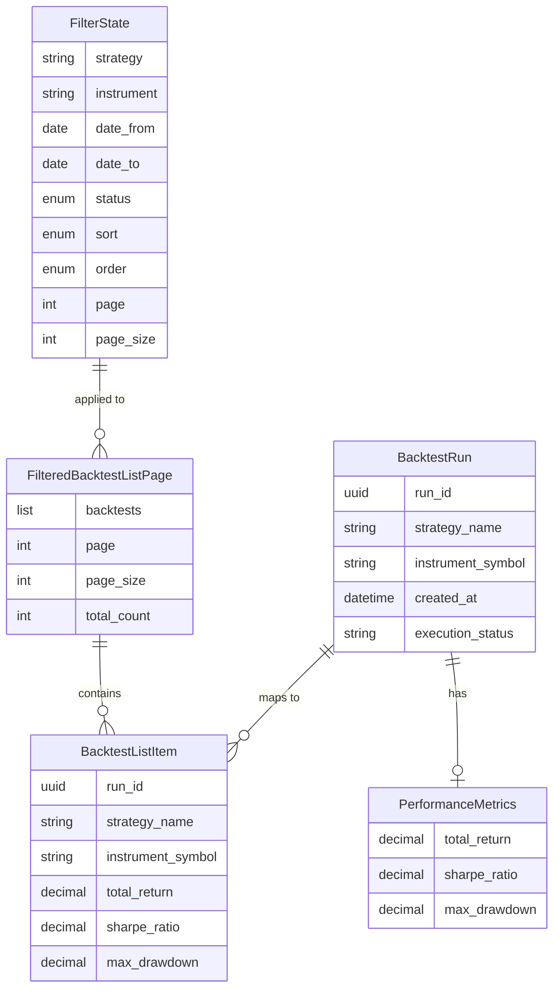

# Data Model: Interactive Backtest Lists

**Date**: 2025-11-15
**Feature**: Interactive Backtest Lists (Phase 2)

## Overview

This document defines the data models for filtering, sorting, and pagination state management. These models extend the existing backtest list infrastructure from Phase 1.

---

## 1. Filter State Models

### 1.1 SortOrder Enum

**Location**: `src/api/models/filter_models.py`

```python
from enum import Enum

class SortOrder(str, Enum):
    """Sort direction for backtest list."""
    ASC = "asc"
    DESC = "desc"
```

**Purpose**: Type-safe sort direction with string serialization for URL parameters.

---

### 1.2 ExecutionStatus Enum

**Location**: `src/api/models/filter_models.py`

```python
from enum import Enum

class ExecutionStatus(str, Enum):
    """Backtest execution outcome."""
    SUCCESS = "success"
    FAILED = "failed"
```

**Purpose**: Type-safe filter for backtest status.

---

### 1.3 SortColumn Enum

**Location**: `src/api/models/filter_models.py`

```python
from enum import Enum

class SortColumn(str, Enum):
    """Valid columns for sorting backtest list."""
    CREATED_AT = "created_at"
    STRATEGY_NAME = "strategy_name"
    INSTRUMENT_SYMBOL = "instrument_symbol"
    TOTAL_RETURN = "total_return"
    SHARPE_RATIO = "sharpe_ratio"
    MAX_DRAWDOWN = "max_drawdown"
    EXECUTION_STATUS = "execution_status"
```

**Purpose**: Restrict sorting to valid database columns only.

---

### 1.4 FilterState Model

**Location**: `src/api/models/filter_models.py`

| Field | Type | Required | Default | Validation | Description |
|-------|------|----------|---------|------------|-------------|
| strategy | Optional[str] | No | None | max_length=255 | Filter by strategy name (exact match) |
| instrument | Optional[str] | No | None | max_length=50 | Filter by instrument symbol (partial match) |
| date_from | Optional[date] | No | None | - | Filter backtests created on or after this date |
| date_to | Optional[date] | No | None | - | Filter backtests created on or before this date |
| status | Optional[ExecutionStatus] | No | None | - | Filter by execution status |
| sort | SortColumn | No | CREATED_AT | - | Column to sort by |
| order | SortOrder | No | DESC | - | Sort direction |
| page | int | No | 1 | ge=1 | Current page number |
| page_size | int | No | 20 | ge=1, le=100 | Results per page |

**Validation Rules**:
- If both `date_from` and `date_to` are provided, `date_to` must be >= `date_from`
- `strategy` must match an existing strategy name in database (validated at query time)
- `instrument` is case-insensitive partial match (e.g., "AP" matches "AAPL")

**Pydantic Model**:
```python
from datetime import date
from typing import Optional
from pydantic import BaseModel, Field, model_validator

class FilterState(BaseModel):
    """
    Complete filter, sort, and pagination state for backtest list.

    Attributes:
        strategy: Filter by exact strategy name
        instrument: Filter by partial instrument symbol match
        date_from: Filter by minimum creation date
        date_to: Filter by maximum creation date
        status: Filter by execution status
        sort: Column to sort by
        order: Sort direction (asc/desc)
        page: Current page number (1-indexed)
        page_size: Number of results per page

    Example:
        >>> state = FilterState(
        ...     strategy="SMA Crossover",
        ...     sort=SortColumn.SHARPE_RATIO,
        ...     order=SortOrder.DESC,
        ...     page=1
        ... )
    """

    strategy: Optional[str] = Field(
        None, max_length=255, description="Filter by strategy name"
    )
    instrument: Optional[str] = Field(
        None, max_length=50, description="Filter by instrument symbol"
    )
    date_from: Optional[date] = Field(
        None, description="Filter backtests created on or after"
    )
    date_to: Optional[date] = Field(
        None, description="Filter backtests created on or before"
    )
    status: Optional[ExecutionStatus] = Field(
        None, description="Filter by execution status"
    )
    sort: SortColumn = Field(
        SortColumn.CREATED_AT, description="Column to sort by"
    )
    order: SortOrder = Field(
        SortOrder.DESC, description="Sort direction"
    )
    page: int = Field(1, ge=1, description="Current page number")
    page_size: int = Field(
        20, ge=1, le=100, description="Results per page"
    )

    @model_validator(mode='after')
    def validate_date_range(self) -> 'FilterState':
        """Ensure end date is not before start date."""
        if self.date_from and self.date_to:
            if self.date_to < self.date_from:
                raise ValueError("End date must be on or after start date")
        return self

    def to_query_params(self) -> dict[str, str]:
        """
        Convert filter state to URL query parameters.

        Returns:
            Dictionary of non-None parameters for URL construction.

        Example:
            >>> state = FilterState(strategy="SMA", page=2)
            >>> state.to_query_params()
            {'strategy': 'SMA', 'sort': 'created_at', 'order': 'desc', 'page': '2'}
        """
        params = {}
        if self.strategy:
            params['strategy'] = self.strategy
        if self.instrument:
            params['instrument'] = self.instrument
        if self.date_from:
            params['date_from'] = self.date_from.isoformat()
        if self.date_to:
            params['date_to'] = self.date_to.isoformat()
        if self.status:
            params['status'] = self.status.value
        params['sort'] = self.sort.value
        params['order'] = self.order.value
        params['page'] = str(self.page)
        return params

    def with_page(self, page: int) -> 'FilterState':
        """Return new FilterState with updated page number."""
        return self.model_copy(update={'page': page})

    def with_sort(self, column: SortColumn) -> 'FilterState':
        """
        Return new FilterState with updated sort column.

        If same column clicked, toggles order. Otherwise, sorts desc.
        """
        if self.sort == column:
            new_order = SortOrder.ASC if self.order == SortOrder.DESC else SortOrder.DESC
        else:
            new_order = SortOrder.DESC
        return self.model_copy(update={'sort': column, 'order': new_order, 'page': 1})

    def clear_filters(self) -> 'FilterState':
        """Return new FilterState with all filters cleared but sort preserved."""
        return FilterState(
            sort=self.sort,
            order=self.order,
            page=1,
            page_size=self.page_size
        )
```

---

## 2. Response Models

### 2.1 FilteredBacktestListPage (extends BacktestListPage)

**Location**: `src/api/models/backtest_list.py` (extended)

| Field | Type | Required | Description |
|-------|------|----------|-------------|
| backtests | list[BacktestListItem] | Yes | Page of filtered backtest items |
| page | int | Yes | Current page number (1-indexed) |
| page_size | int | Yes | Results per page |
| total_count | int | Yes | Total matching backtests (after filtering) |
| total_pages | int | Computed | Total number of pages |
| has_next | bool | Computed | Whether next page exists |
| has_previous | bool | Computed | Whether previous page exists |
| filter_state | FilterState | Yes | Current filter/sort state |
| available_strategies | list[str] | Yes | Distinct strategy names for dropdown |
| available_instruments | list[str] | Yes | Distinct instrument symbols for autocomplete |

**Note**: Uses existing `BacktestListPage` as base, adds filter context.

```python
class FilteredBacktestListPage(BacktestListPage):
    """
    Paginated response with filter state context.

    Extends BacktestListPage with filter state and available options.
    """

    filter_state: FilterState = Field(
        ..., description="Current filter and sort state"
    )
    available_strategies: list[str] = Field(
        default_factory=list, description="Distinct strategy names"
    )
    available_instruments: list[str] = Field(
        default_factory=list, description="Distinct instrument symbols"
    )
```

---

## 3. View Context Models

### 3.1 SortableColumn

**Location**: `src/api/models/filter_models.py`

| Field | Type | Description |
|-------|------|-------------|
| name | SortColumn | Column identifier |
| label | str | Display label for header |
| css_class | str | CSS classes for alignment (text-left, text-right) |
| is_current | bool | Whether this column is currently sorted |
| sort_indicator | str | Arrow icon (↑ or ↓) or empty |
| next_sort_url | str | URL for clicking this header |

```python
class SortableColumn(BaseModel):
    """
    Column header metadata for sortable table.

    Used by Jinja template to render clickable headers with indicators.
    """

    name: SortColumn
    label: str
    css_class: str = "text-left"
    is_current: bool = False
    sort_indicator: str = ""
    next_sort_url: str = ""
```

---

### 3.2 PaginationControl

**Location**: `src/api/models/filter_models.py`

| Field | Type | Description |
|-------|------|-------------|
| page_number | int | Page number |
| url | str | URL for this page |
| is_current | bool | Whether this is current page |
| is_disabled | bool | Whether button should be disabled |
| label | str | Display text (number or "Previous"/"Next") |

```python
class PaginationControl(BaseModel):
    """
    Pagination button metadata.

    Used by Jinja template to render pagination controls.
    """

    page_number: int
    url: str
    is_current: bool = False
    is_disabled: bool = False
    label: str = ""
```

---

## 4. Database Entities (Existing)

### 4.1 BacktestRun (No Changes)

**Location**: `src/db/models/backtest.py`

The existing BacktestRun model already has all fields needed for filtering:
- `strategy_name`: String field for strategy filter
- `instrument_symbol`: String field for instrument filter
- `created_at`: Timestamp for date range filter
- `execution_status`: String field for status filter

**Existing Indexes** (from Phase 1):
- `idx_backtest_runs_created_id`: (created_at, id)
- `idx_backtest_runs_strategy_created_id`: (strategy_name, created_at, id)

**New Indexes Required**:
- `idx_backtest_runs_instrument`: (instrument_symbol)
- `idx_backtest_runs_status`: (execution_status)

---

### 4.2 PerformanceMetrics (No Changes)

**Location**: `src/db/models/backtest.py`

The existing PerformanceMetrics model provides sortable metrics:
- `total_return`: For sorting by return
- `sharpe_ratio`: For sorting by Sharpe ratio
- `max_drawdown`: For sorting by max drawdown

Sorting by these fields requires JOIN with metrics table.

---

## 5. Entity Relationships



---

## 6. State Transitions

### FilterState Lifecycle

1. **Initial Load**: Default FilterState (no filters, sort by created_at desc)
2. **URL Restoration**: Parse query parameters into FilterState
3. **Filter Change**: Update specific filter field, reset page to 1
4. **Sort Change**: Toggle sort column/order, reset page to 1
5. **Page Change**: Update page number only
6. **Clear Filters**: Reset all filters to None, keep sort settings

### Request Flow

```
Browser Request
    ↓
FastAPI Query Parameters
    ↓
FilterState Pydantic Model
    ↓
BacktestRepository.get_filtered()
    ↓
SQLAlchemy Query Builder
    ↓
PostgreSQL (uses indexes)
    ↓
BacktestRun + PerformanceMetrics
    ↓
to_list_item() mapping
    ↓
FilteredBacktestListPage
    ↓
Jinja2 Template Rendering
    ↓
HTML Response (full page or HTMX fragment)
```

---

## 7. Validation Rules Summary

| Model | Field | Rule | Error Message |
|-------|-------|------|---------------|
| FilterState | date_to | >= date_from if both set | "End date must be on or after start date" |
| FilterState | page | >= 1 | "Page must be positive" |
| FilterState | page_size | 1-100 | "Page size must be between 1 and 100" |
| FilterState | strategy | max 255 chars | "Strategy name too long" |
| FilterState | instrument | max 50 chars | "Instrument symbol too long" |

---

## 8. Migration Plan

### New Database Index Migration

**File**: `src/db/migrations/versions/XXX_add_filter_indexes.py`

```python
"""Add indexes for backtest filtering.

Revision ID: XXX
"""

from alembic import op

def upgrade() -> None:
    op.create_index(
        'idx_backtest_runs_instrument',
        'backtest_runs',
        ['instrument_symbol']
    )
    op.create_index(
        'idx_backtest_runs_status',
        'backtest_runs',
        ['execution_status']
    )

def downgrade() -> None:
    op.drop_index('idx_backtest_runs_status')
    op.drop_index('idx_backtest_runs_instrument')
```

---

## Summary

The data model for Interactive Backtest Lists introduces:
- **3 new Pydantic models**: FilterState, SortableColumn, PaginationControl
- **3 new enums**: SortOrder, ExecutionStatus, SortColumn
- **1 extended model**: FilteredBacktestListPage
- **2 new database indexes**: instrument_symbol, execution_status
- **No changes** to existing database schema (only new indexes)

All models follow Pydantic v2 patterns with comprehensive validation, type safety, and serialization support.
